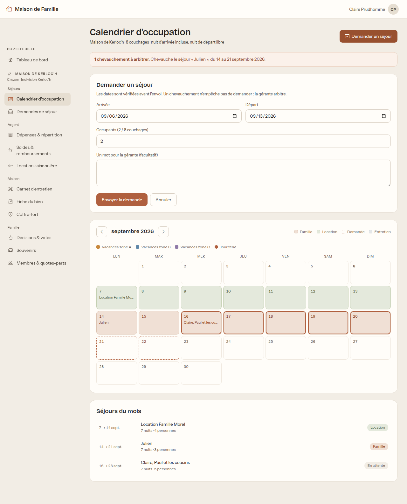
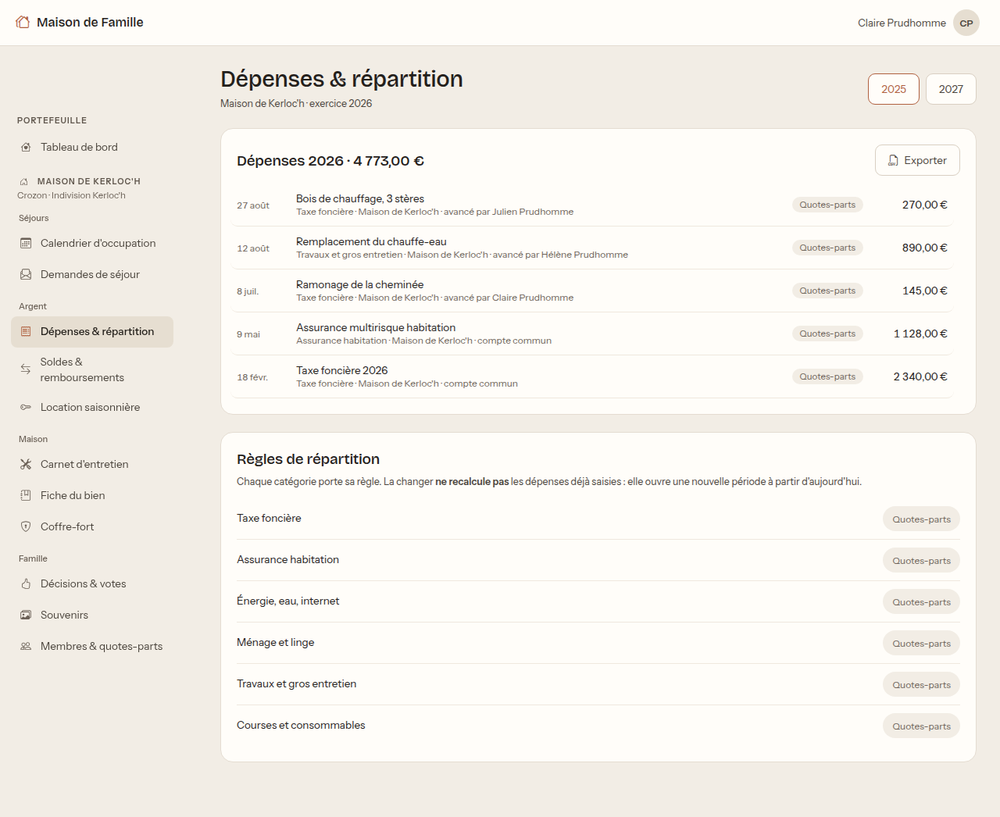
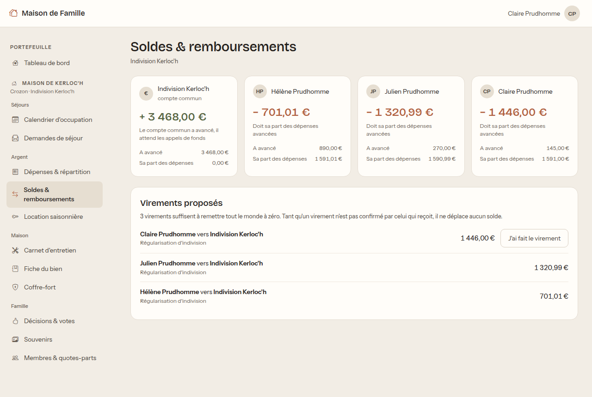
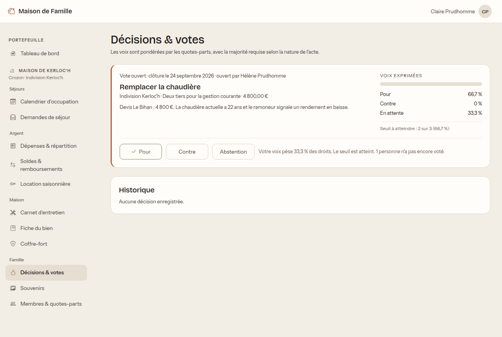
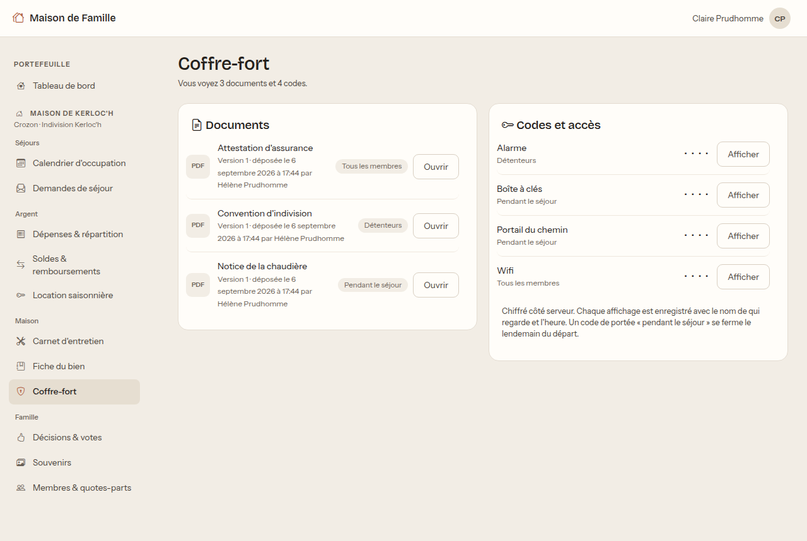

# Guide du détenteur

Vous possédez une part de la maison : vous êtes **indivisaire** si elle est en
indivision, **associé** si elle est en SCI. L'application emploie le mot qui
convient à votre situation.

Vous ne gérez pas la maison au quotidien, mais vous voyez tout ce qui vous
concerne : le calendrier, l'argent, l'entretien, les papiers, et vous votez les
décisions.

Lisez d'abord **[Premiers pas](premiers-pas.md)** si ce n'est pas fait.

## Votre écran d'accueil

Trois cartes :

- **Ce qui vous attend** : les tâches d'entretien en retard ou proches.
- **Trésorerie** : ce qu'il reste à régulariser dans la structure.
- **Prochains séjours** : qui vient, et quand.

Si vous n'avez qu'une seule maison, vous arrivez directement dedans. Si vous en
avez plusieurs, une barre en haut vous permet de passer de l'une à l'autre.

## Demander un séjour

C'est ce que vous ferez le plus souvent.

1. Ouvrez **Calendrier d'occupation**.
2. Cliquez sur **Demander un séjour**, en haut à droite.
3. Saisissez l'arrivée, le départ, le nombre d'occupants, et un mot pour le
   gérant si vous voulez expliquer quelque chose.
4. **Envoyer la demande.**

Les dates sont vérifiées **avant l'envoi**, auprès du serveur. Si votre demande
en croise une autre, l'application vous le dit tout de suite, avec le séjour
concerné et ses dates.

> **Un chevauchement n'empêche pas de demander.** Vous pouvez envoyer quand même :
> c'est au gérant d'arbitrer, et votre mot d'accompagnement sert précisément à
> ça (« nous pouvons décaler si Julien tient à ces dates »).

Le nombre d'occupants est comparé à la capacité en couchages. Par défaut,
l'application signale un dépassement sans bloquer ; un réglage permet au gérant
de le rendre bloquant.

### Comment lire le calendrier

- Chaque **couleur** correspond à une nature de séjour, expliquée dans la légende
  du haut : famille, location, demande en attente, entretien.
- Une demande pas encore validée apparaît en **pointillés**.
- Les **bandeaux fins sous les cases** sont les vacances scolaires, un par zone,
  toujours à la même hauteur. Le décalage d'une semaine entre A, B et C dessine
  un escalier.
- Un **jour férié** est marqué sur le numéro du jour, en gras avec un point.
- **Séjours du mois**, en bas, reprend la liste sous forme de texte, avec le
  statut de chacun.

Passez la souris sur une case pour avoir le détail du jour.

### Suivre et annuler votre demande

**Demandes de séjour** montre où en sont les vôtres. Vous pouvez annuler une
demande ou un séjour à vous, tant qu'il n'a pas commencé.

Un séjour annulé n'est pas effacé : il reste dans l'historique, marqué annulé,
avec sa date.

## L'argent

### Les dépenses

Vous voyez toutes les dépenses de la structure, leur montant, qui a payé, et le
détail de la répartition : **votre part figure noir sur blanc.**

Ce qui compte, et qui surprend souvent : **une dépense est partagée selon les
quotes-parts en vigueur à sa date**, pas selon celles d'aujourd'hui. Si la
répartition a changé en mars, une dépense de février reste partagée comme avant.
C'est délibéré, et c'est ce qui rend l'historique fiable.

### Les soldes

Pour chacun : ce qu'il a avancé, sa part des dépenses, et la différence.

- Un **solde négatif** veut dire que vous devez de l'argent.
- Un **solde positif** veut dire qu'on vous en doit.

Les **virements proposés** sont le plus petit nombre de virements qui remet tout
le monde à zéro. L'application ne fait aucun paiement : elle vous dit quoi virer,
à qui.

> **Confirmez un virement seulement quand vous l'avez reçu.** Le bouton
> n'apparaît que sur les virements qui vous concernent, et tant qu'un virement
> n'est pas confirmé par celui qui reçoit, il ne déplace aucun solde.

Si vous avez avancé de l'argent pour la maison, demandez à un gérant de saisir la
dépense à votre nom : elle apparaîtra alors dans votre colonne « A avancé » et
remontera votre solde.

## Voter une décision

Quand un gérant ouvre un scrutin (remplacer une chaudière, vendre un terrain),
vous êtes prévenu et vous votez : **pour**, **contre**, ou vous vous abstenez en
ne votant pas.

Chaque scrutin affiche la règle de majorité qui s'y applique, la date de clôture,
et où en est le décompte.

Deux points qui comptent :

> **Le corps électoral est figé à l'ouverture du scrutin.** Si vous acquérez des
> parts pendant un vote, elles ne compteront qu'au prochain. Si vous cédez les
> vôtres, vous gardez votre voix sur ce scrutin. Sinon, un rachat de parts
> changerait un résultat déjà en cours.

> **Ne pas voter n'est pas voter contre, mais ce n'est pas voter pour non plus.**
> Le seuil se calcule sur l'ensemble des parts. Deux voix « pour » sur quatre
> indivisaires à parts égales font 50 %, ce qui peut suffire ou non selon la
> règle, même si personne n'a voté contre. Si le sujet vous importe, votez.

Un rappel part avant la clôture si vous n'avez pas voté.

## Les papiers et les codes

Le coffre-fort contient les documents de la maison et les codes d'accès.

En tant que détenteur, vous voyez le plus large : les documents réservés aux
détenteurs (convention d'indivision, actes), ceux ouverts aux membres, et les
codes de votre séjour quand il approche.

Cliquez sur **Afficher** pour révéler un code. Deux choses à savoir, dites
franchement :

- **Chaque affichage est enregistré** avec votre nom et l'heure. Ce n'est pas de
  la surveillance : c'est ce qui permet de savoir qui a vu le code de l'alarme le
  jour où il faut le changer.
- Les codes sont **chiffrés sur le serveur** et ne sont envoyés qu'à la demande.

Un code marqué « pendant le séjour » n'apparaît que quelques jours avant votre
arrivée, et disparaît après votre départ.

## Le reste

- **Carnet d'entretien** : ce qui est fait, ce qui est en retard, ce qui vient.
  Vous pouvez **signaler une casse** : cela crée une tâche pour le gérant.
- **Fiche du bien** : les caractéristiques, le guide pratique (vanne d'eau,
  poubelles, stationnement), et le carnet d'adresses des artisans.
- **Membres et quotes-parts** : qui détient quoi, et l'historique complet des
  répartitions avec leur motif et leur date d'effet.
- **Souvenirs** : les albums photo des séjours passés.
- **Location saisonnière**, si la maison est louée : les réservations et le net
  de la saison.

## Ce que vous ne pouvez pas faire

Ce n'est pas un oubli, c'est la répartition des rôles :

- **Valider une demande de séjour**, y compris la vôtre. Un gérant arbitre.
- **Saisir ou modifier une dépense.** Vous les voyez toutes, avec leur
  justificatif.
- **Changer les quotes-parts.** Vous voyez la répartition et son historique.
- **Modifier le coffre-fort, la fiche, le carnet d'entretien.** Vous les lisez, et
  vous pouvez signaler une casse.
- **Voir une maison à laquelle vous n'êtes pas rattaché.** Même en tapant
  l'adresse directement, il ne s'affiche rien.

## Questions fréquentes

**Je ne vois pas la maison de mon cousin.** Elle appartient à une autre structure
dont vous ne détenez pas de parts. C'est la règle centrale de l'application : on
ne voit rien d'un bien auquel on n'est pas rattaché.

**Ma part des dépenses ne correspond pas à mon pourcentage actuel.** Regardez la
date de la dépense, puis l'historique des quotes-parts. Elle a été partagée avec
la répartition en vigueur ce jour-là.

**J'ai payé quelque chose pour la maison.** Transmettez le justificatif à un
gérant, qui saisira la dépense à votre nom. Elle remontera votre solde.

**Ma demande de séjour est restée sans réponse.** Le gérant reçoit une
notification, mais relancez-le : l'application ne valide rien toute seule.

**Je veux céder mes parts.** C'est un acte qui se passe chez le notaire. Une fois
signé, un gérant saisit la nouvelle répartition avec la date d'effet de l'acte,
et votre historique reste consultable.
