# Guide du gérant

Vous arbitrez les séjours, vous tenez les comptes, vous rangez les papiers. Ce
guide couvre tout ce que vous pouvez faire, écran par écran.

Lisez d'abord **[Premiers pas](premiers-pas.md)** si ce n'est pas fait.

> **Une règle à connaître avant tout.** Être gérant ne veut pas dire posséder.
> Vous pouvez gérer une maison sans y détenir la moindre part, et un indivisaire
> peut ne rien gérer. Ce sont deux choses séparées, exprès.

## Sommaire

1. [Vos repères](#1-vos-repères)
2. [Arbitrer les demandes de séjour](#2-arbitrer-les-demandes-de-séjour)
3. [Le calendrier](#3-le-calendrier)
4. [Les personnes et les rôles](#4-les-personnes-et-les-rôles)
5. [Les quotes-parts](#5-les-quotes-parts)
6. [Les dépenses](#6-les-dépenses)
7. [Les soldes et les remboursements](#7-les-soldes-et-les-remboursements)
8. [Le carnet d'entretien](#8-le-carnet-dentretien)
9. [Le coffre-fort](#9-le-coffre-fort)
10. [La fiche du bien](#10-la-fiche-du-bien)
11. [Les décisions et les votes](#11-les-décisions-et-les-votes)
12. [La location saisonnière](#12-la-location-saisonnière)
13. [Les invités par lien](#13-les-invités-par-lien)
14. [Les réglages](#14-les-réglages)
15. [Reprendre un planning existant](#15-reprendre-un-planning-existant)
16. [Sortir vos données](#16-sortir-vos-données)
17. [L'état du service](#17-létat-du-service)

## 1. Vos repères

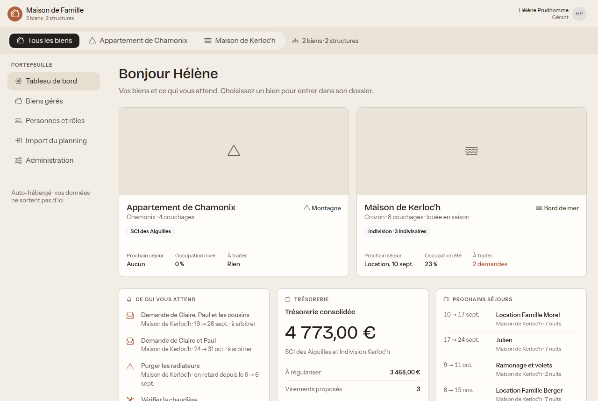

Le bandeau du haut liste vos maisons. **Tous les biens** donne la vue
d'ensemble ; cliquer sur une maison entre dans son dossier et le menu de gauche
se remplit.

La carte **Ce qui vous attend** est votre file de travail : demandes à arbitrer,
tâches en retard, échéances proches. Si elle est vide, il n'y a rien à faire.

L'écran **Biens gérés** liste vos maisons et permet d'en ajouter une.

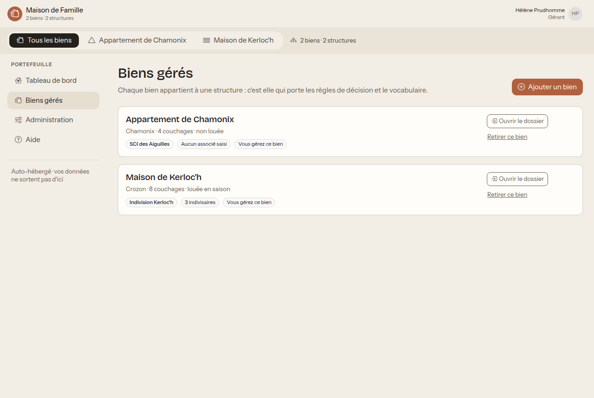

## 2. Arbitrer les demandes de séjour

C'est votre travail le plus fréquent.

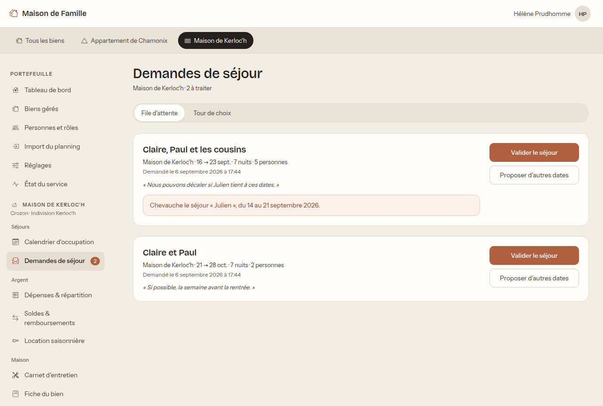

Le chiffre à côté de « Demandes de séjour » dans le menu compte ce qui attend.

Chaque demande affiche qui, quand, combien de nuits, combien de personnes, et le
mot laissé par le demandeur. **Un chevauchement est signalé en clair**, avec le
séjour qu'il croise et ses dates : vous décidez en connaissance de cause.

Deux boutons :

- **Valider le séjour** : la demande devient un séjour ferme, le demandeur est
  prévenu.
- **Proposer d'autres dates** : vous refusez ces dates en expliquant pourquoi.
  Le demandeur reçoit votre message et peut redemander.

L'onglet **Tour de choix** sert quand plusieurs foyers veulent la même semaine :
il propose un ordre de passage plutôt que de laisser le plus rapide gagner.

> **Un chevauchement n'est pas toujours un problème.** Un départ le matin et une
> arrivée le soir du même jour ne se chevauchent pas : l'application ne les
> signale pas. Voir la convention des nuits dans [Premiers pas](premiers-pas.md).

Vous pouvez aussi **saisir un séjour pour quelqu'un d'autre**, depuis le
calendrier : il naît validé, sans passer par la file d'attente. C'est ce qu'on
fait pour un séjour convenu au téléphone, ou pour bloquer des dates de travaux.

## 3. Le calendrier

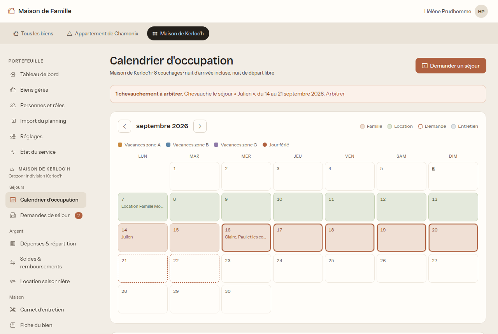

Une case par jour, une couleur par nature de séjour (famille, location, demande
en attente, entretien). La légende est en haut.

Les **bandeaux fins sous chaque case** sont les vacances scolaires, une ligne par
zone, toujours à la même hauteur : le décalage d'une semaine entre les zones A, B
et C dessine un escalier qui se lit d'un coup d'oeil. Un **jour férié** est marqué
sur le numéro du jour, en gras avec un point. Passez la souris sur une case pour
avoir le détail.

Si un bandeau d'avertissement dit que les vacances ne sont pas renseignées pour
la période affichée, allez les déposer : voir [Les réglages](#14-les-réglages).

## 4. Les personnes et les rôles

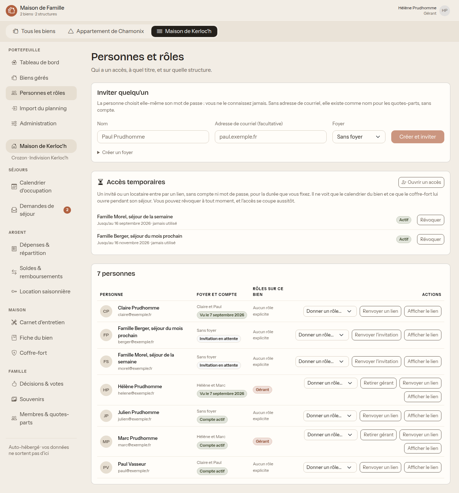

### Inviter quelqu'un

Un nom, une adresse de courriel, et éventuellement un foyer. La personne
**choisit elle-même son mot de passe** : vous ne le connaissez jamais.

L'adresse est facultative. Sans elle, la personne existe comme nom pour les
quotes-parts, sans compte : c'est ce qu'on fait pour un indivisaire décédé dont
il faut garder l'historique, ou pour quelqu'un qui ne veut pas d'accès.

Si les courriels ne sont pas configurés, ou si le courriel se perd,
**Afficher le lien** vous donne l'adresse à transmettre vous-même.

### Les foyers

Un foyer réunit deux conjoints. Ce qui est accordé à l'un rejaillit sur l'autre :
le conjoint d'un indivisaire voit le calendrier et peut demander un séjour sans
que vous ayez à le saisir deux fois.

### Donner un rôle

Le menu **Donner un rôle** attribue un rôle sur une structure. Vous n'avez
**pas besoin de le faire pour un indivisaire** : détenir des parts suffit à être
détenteur, c'est pourquoi la liste affiche « Aucun rôle explicite » en face de
gens qui ont pourtant tous les droits d'un détenteur.

Vous vous en servez pour :

- **désigner un second gérant** (fortement recommandé, voir plus bas) ;
- donner un accès **invité** à quelqu'un qui n'a ni parts ni conjoint dans la
  famille.

> **Désignez toujours un second gérant.** L'application vous le rappelle par un
> avertissement tant qu'il n'y en a qu'un. La raison est simple : si cette
> personne perd son mot de passe, son téléphone de second facteur, ou pire, plus
> personne ne peut arbitrer une demande ni saisir un séjour.

## 5. Les quotes-parts

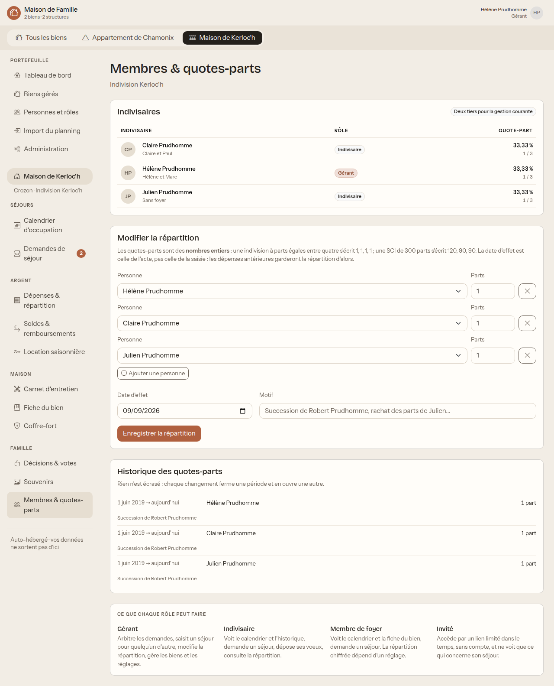

C'est le point le plus important de l'application, et celui qu'il ne faut pas
prendre à la légère.

Les quotes-parts s'écrivent en **nombres entiers** : une indivision à parts égales
entre quatre s'écrit `1, 1, 1, 1` ; une SCI de 300 parts s'écrit `120, 90, 90`.
L'application calcule les pourcentages toute seule.

### La date d'effet, et pourquoi elle compte

> **La date d'effet est celle de l'acte, pas celle de votre saisie.**

Quand vous enregistrez une nouvelle répartition, vous ne remplacez pas
l'ancienne : vous **fermez une période et vous en ouvrez une autre**. Les
dépenses antérieures gardent la répartition qui avait cours à leur date.

Concrètement : si Julien rachète les parts de Claire le 1er mars, vous saisissez
la nouvelle répartition avec la date d'effet du 1er mars, même si vous le faites
en juin. La taxe foncière payée en février reste partagée comme avant. Aucune
ventilation passée n'est recalculée, jamais.

L'**Historique des quotes-parts**, en bas de l'écran, montre toutes les périodes
avec leur motif. Renseignez le motif : dans six ans, « Succession de Robert
Prudhomme » vaudra mieux que rien.

## 6. Les dépenses

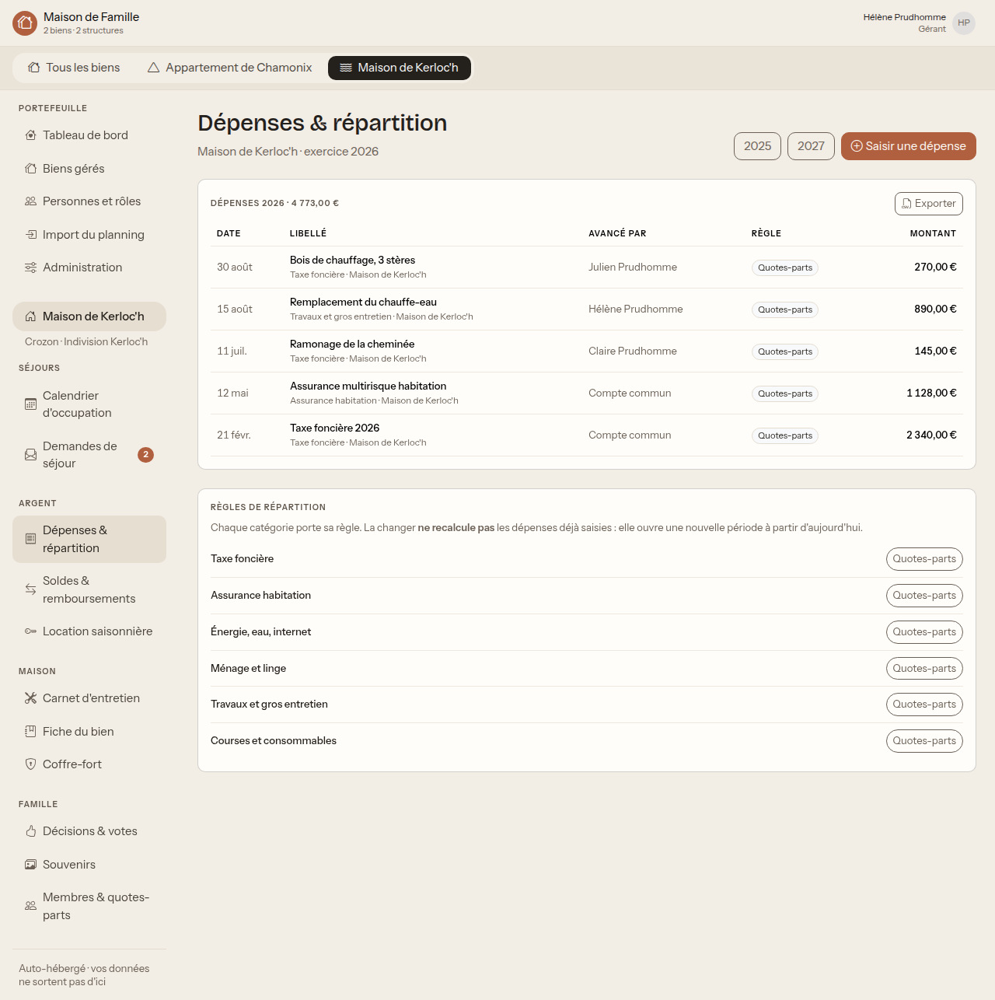

Une dépense porte une date, un libellé, une catégorie, un montant, et deux
informations qui déterminent tout le reste :

- **Qui a payé** : le compte commun de la structure, ou une personne qui a avancé
  l'argent.
- **Sur quel bien**, et dans quelle proportion si la dépense en concerne
  plusieurs.

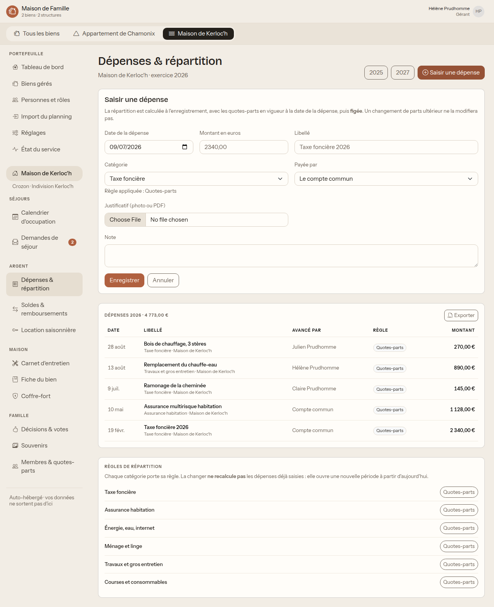

Vous pouvez joindre un **justificatif** (photo ou PDF). Il n'est visible que des
personnes qui ont le droit de voir la dépense.

### Comment le partage est calculé

L'application applique les quotes-parts **en vigueur à la date de la dépense**,
et fige le résultat. Une dépense du 12 février est partagée selon la répartition
du 12 février, quelle que soit celle d'aujourd'hui.

Si vous corrigez une erreur de saisie sur les parts, un bouton **Recalculer**
permet de refaire la ventilation d'une dépense précise. C'est volontairement un
geste explicite : rien ne se recalcule tout seul dans votre dos.

### Annuler une dépense

Une dépense ne se supprime pas, elle **s'annule** : elle reste visible, marquée
comme annulée, avec sa date. C'est ce qui permet d'expliquer un écart six mois
plus tard.

## 7. Les soldes et les remboursements

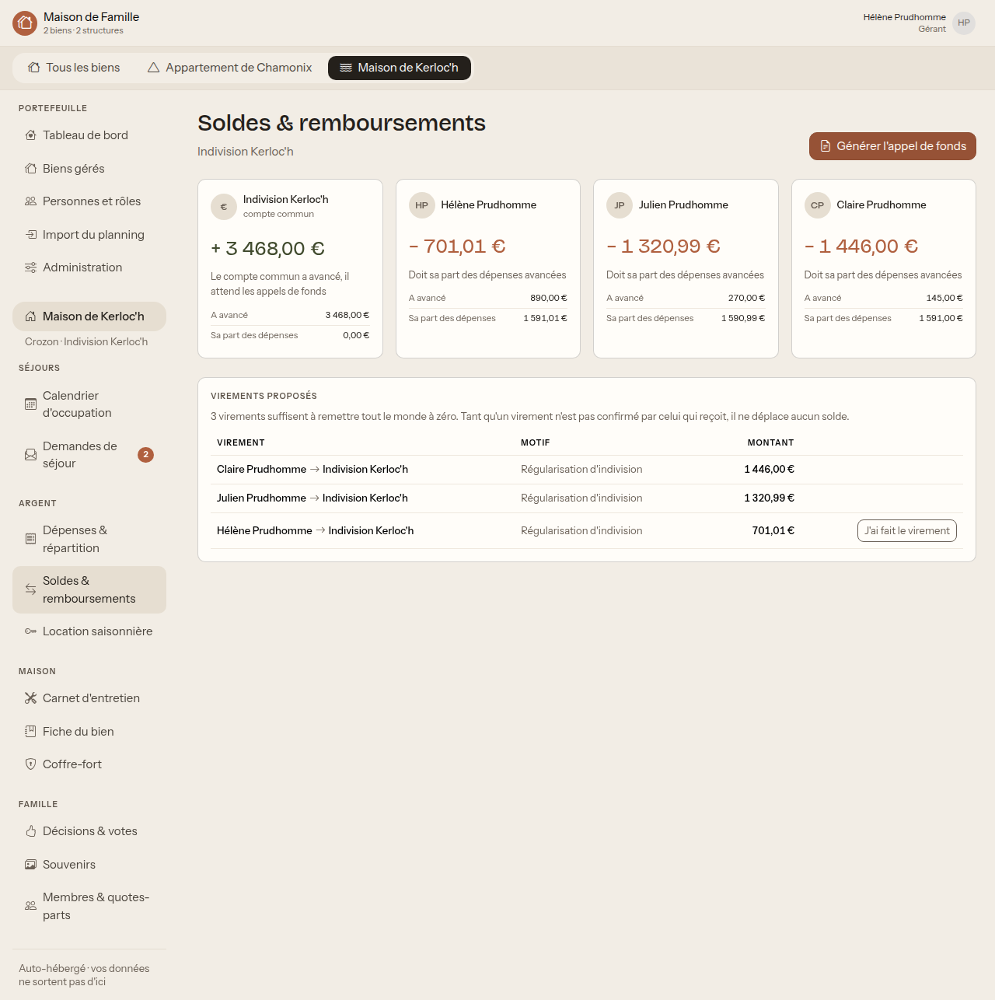

Pour chaque personne : ce qu'elle a avancé, ce que représente sa part des
dépenses, et la différence. Un solde négatif veut dire qu'elle doit, un solde
positif qu'on lui doit.

Les **virements proposés** sont le plus petit nombre de virements qui remet tout
le monde à zéro. L'application ne fait aucun paiement : elle dit qui doit envoyer
combien à qui.

> **Un virement proposé ne déplace rien tant qu'il n'est pas confirmé par celui
> qui reçoit.** Chacun ne peut confirmer que ses propres virements. C'est ce qui
> évite qu'un solde change parce que quelqu'un a cliqué trop vite.

**Générer l'appel de fonds** produit le document à envoyer aux détenteurs quand
le compte commun doit être réalimenté.

## 8. Le carnet d'entretien

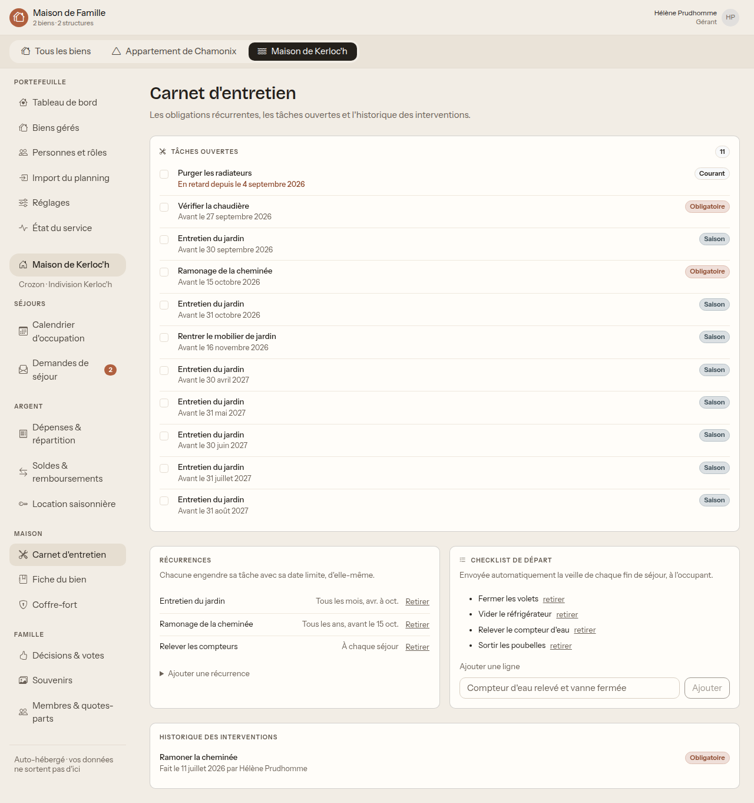

Quatre parties sur un seul écran.

**Les tâches ouvertes**, classées par urgence : en retard, proche, plus tard.

**Les récurrences** engendrent les tâches toutes seules. Trois formes :

| Périodicité | Exemple | Ce qu'on saisit |
| --- | --- | --- |
| Annuelle | Ramonage, tous les ans avant le 15 octobre | Une date limite dans l'année |
| Mensuelle | Entretien du jardin, tous les mois d'avril à octobre | Un mois de début et un mois de fin |
| À chaque séjour | Relever les compteurs | Rien d'autre |

**L'inventaire** liste le matériel et son état. Un membre de la famille peut
**signaler une casse** depuis son écran : cela crée à la fois une ligne
d'inventaire et une tâche pour vous. C'est ouvert à tous exprès, parce que celui
qui casse un matelas est rarement celui qui gère la maison.

**La checklist de départ** est envoyée automatiquement la veille de la fin de
chaque séjour à celui qui occupe la maison.

Cocher une tâche **demande la date de réalisation**, et ne la déduit pas. Une
haie taillée le 12 juin et cochée le 3 septembre reste taillée le 12 juin. Vous
pouvez joindre la facture au passage.

## 9. Le coffre-fort

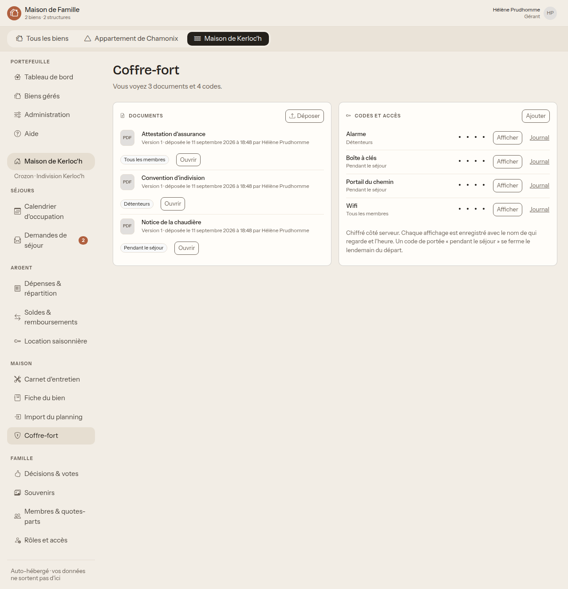

Deux choses y vivent : des **documents** (convention d'indivision, attestation
d'assurance, notices) et des **codes** (portail, boîte à clés, wifi, alarme).

### La portée, c'est-à-dire qui voit quoi

Chaque document et chaque code porte une portée. C'est le réglage le plus
important de cet écran :

| Portée | Qui le voit |
| --- | --- |
| **Pendant le séjour** | Toute personne dont le séjour est en cours, y compris un locataire ou un invité par lien |
| **Membres** | Les personnes rattachées au bien, y compris les membres de foyer |
| **Détenteurs** | Les seuls détenteurs de parts |

> **Un code de portée « pendant le séjour » s'ouvre quelques jours avant
> l'arrivée et se ferme le lendemain du départ.** Le nombre de jours se règle
> dans l'Administration. Un code encore affiché à quelqu'un dont le séjour est
> terminé est une faille : c'est pour cela que la fenêtre se referme toute seule.

### Ce que le coffre garantit

- Les codes sont **chiffrés sur le serveur**. Une copie volée de la base ne rend
  aucun code.
- La valeur d'un code **n'est jamais envoyée avec la liste** : il faut cliquer sur
  « Afficher » pour la demander.
- **Chaque affichage est enregistré** avec le nom de qui a regardé et l'heure.
  Vous pouvez consulter ce journal pour chaque code.

Un document se **verse en nouvelle version** plutôt que d'être remplacé :
l'attestation d'assurance de l'an dernier reste consultable.

## 10. La fiche du bien

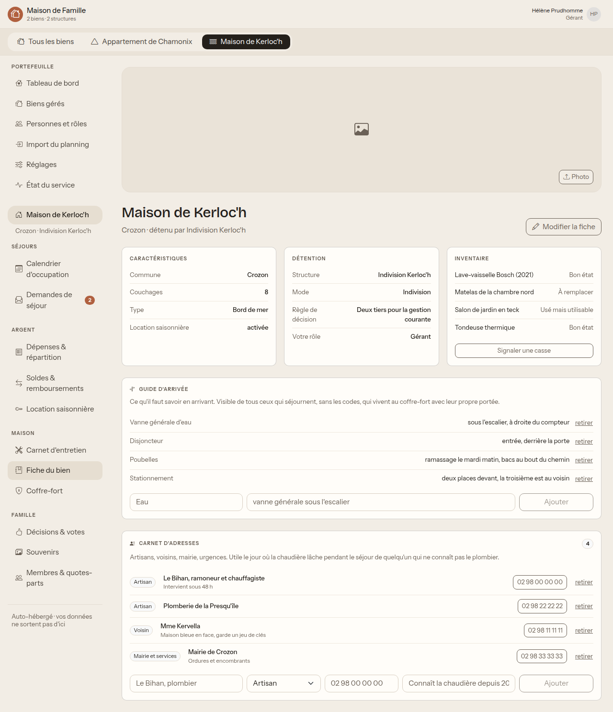

Trois choses sur un écran :

- **Les caractéristiques** : surface, chauffage, ce qui décrit la maison.
- **Le guide pratique** : où est la vanne d'eau, quel jour passent les poubelles,
  où se garer. C'est ce que lit un invité qui arrive un vendredi soir.
- **Le carnet d'adresses** : artisans, voisins, mairie, urgences.

C'est aussi ici que vous modifiez le nom, la commune, la capacité en couchages,
la photo, et que vous **activez la location saisonnière** pour ce bien.

## 11. Les décisions et les votes

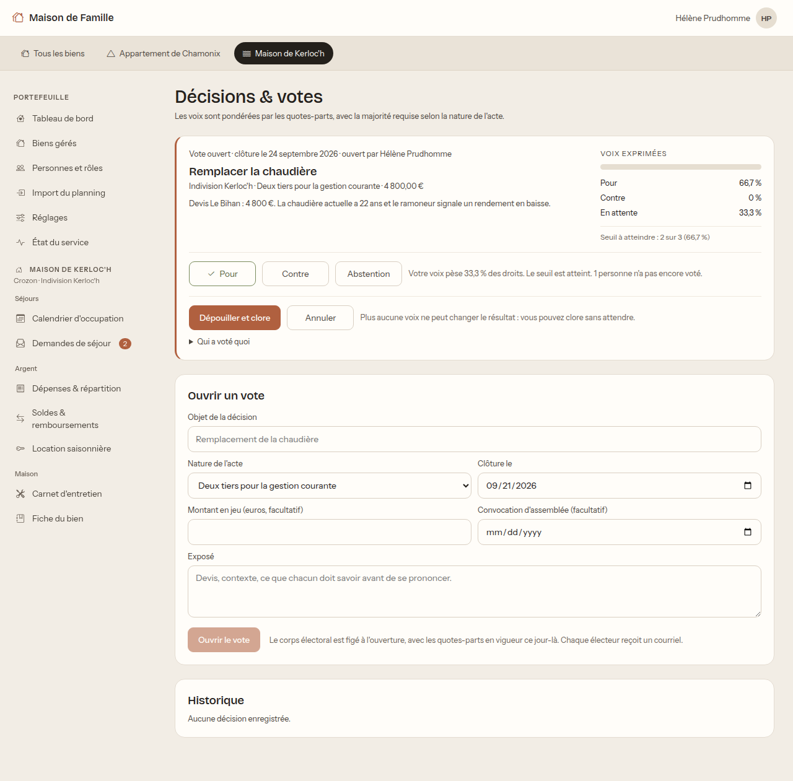

Pour ce qui ne se décide pas seul : remplacer une chaudière, vendre un terrain,
refaire une toiture.

Vous ouvrez un scrutin avec un titre, un exposé, un montant si c'est une dépense,
et une date de clôture. La **règle de majorité** est celle attachée au type
d'acte (gestion courante, acte grave), telle qu'elle est définie pour la
structure.

> **Le corps électoral est figé à l'ouverture du scrutin.** Quelqu'un qui acquiert
> des parts en cours de vote ne vote pas sur ce scrutin, et quelqu'un qui les cède
> garde sa voix. Sans cela, un rachat de parts changerait le résultat d'un vote
> déjà commencé.

À la clôture, **Dépouiller** calcule le résultat et affiche l'explication : le
total des voix, le seuil requis, et si la décision est adoptée. L'explication est
écrite en toutes lettres, pas en pourcentages secs.

Attention à une subtilité que l'application vous montrera : **un silence n'est pas
une voix contre, mais il ne compte pas comme une voix pour.** Deux votes « pour »
sur quatre indivisaires à parts égales font 50 %, pas 100 %, même si personne n'a
voté contre.

## 12. La location saisonnière

Ce module **s'active bien par bien**, depuis la fiche du bien. Sur un bien qui
n'est pas loué, l'entrée n'apparaît même pas dans le menu.

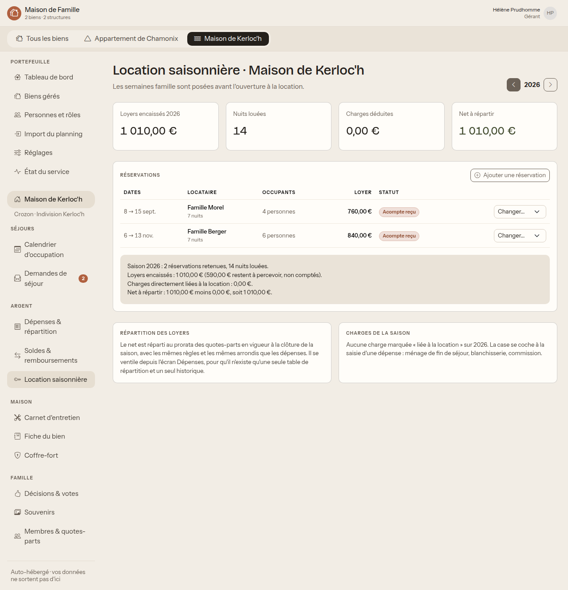

Une réservation, c'est un locataire, des dates, un loyer, un acompte, et un
statut (à confirmer, acompte reçu, soldé, annulé).

> **Une réservation est un séjour comme un autre.** Elle apparaît dans le
> calendrier et bloque les dates exactement comme un séjour de famille. C'est ce
> qui permet à l'application de vous prévenir si vous ouvrez à la location une
> semaine déjà demandée par la famille.

L'écran calcule le **net de la saison** : encaissé, attendu, charges déductibles,
et le résultat, avec le nombre de nuits louées.

Les charges déductibles ne sont pas une comptabilité à part : ce sont des
dépenses ordinaires que vous marquez comme telles à la saisie.

## 13. Les invités par lien

Pour un locataire, un ami ou un artisan qui n'a pas besoin d'un compte.

Depuis **Personnes et rôles**, section **Accès temporaires** (visible quand une
maison est ouverte) : **Ouvrir un accès**. Vous donnez un libellé, une date
d'expiration, et éventuellement le séjour concerné.

Vous obtenez un lien à transmettre. La personne entre par ce lien, **sans compte
ni mot de passe**. Elle ne voit que le calendrier du bien, la fiche pratique, et
ce que le coffre-fort lui ouvre pendant son séjour.

Trois garde-fous :

- l'accès **expire** à la date que vous avez fixée ;
- un accès temporaire **ne dépasse pas un an** ; au-delà, ce n'est plus un lien de
  passage et il faut ouvrir un vrai compte ;
- vous pouvez **révoquer** à tout moment, et l'accès se coupe aussitôt.

## 14. Les réglages

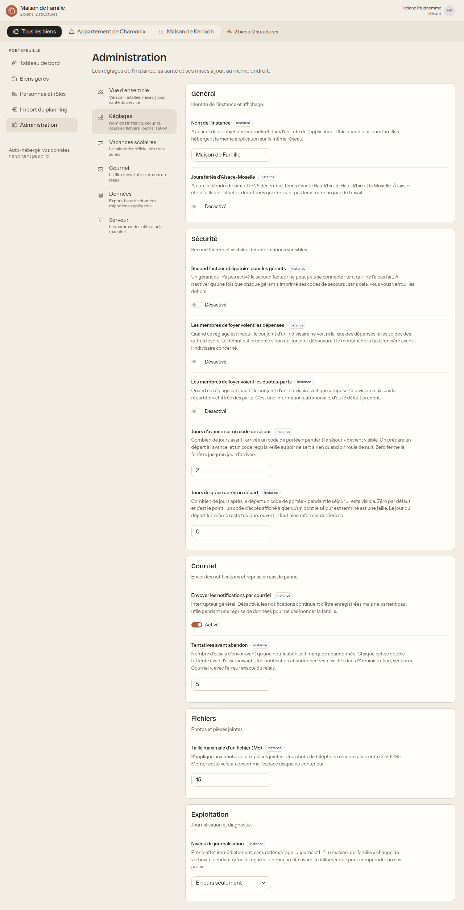

Chaque réglage dit ce qu'il change et où l'effet se voit. Ceux marqués « ce bien »
sont propres à la maison ouverte, les autres valent pour toute l'instance.

Les plus utiles :

- **Second facteur obligatoire pour les gérants**. À n'activer qu'une fois que
  chaque gérant a imprimé ses codes de secours, sans quoi vous vous verrouillez
  dehors.
- **Les membres de foyer voient les dépenses** et **voient les quotes-parts**.
  Éteints par défaut, exprès : sinon un conjoint découvrirait le montant de la
  taxe foncière ou la répartition patrimoniale avant l'indivisaire concerné.
- **Jours d'avance sur un code de séjour** et **jours de grâce après un départ**.
  Combien de temps avant l'arrivée un code devient visible, et combien de temps
  après le départ il le reste. Zéro jour de grâce est le choix prudent.
- **Refuser une demande qui dépasse les couchages**. Par défaut, l'application
  signale sans bloquer.

### Les vacances scolaires

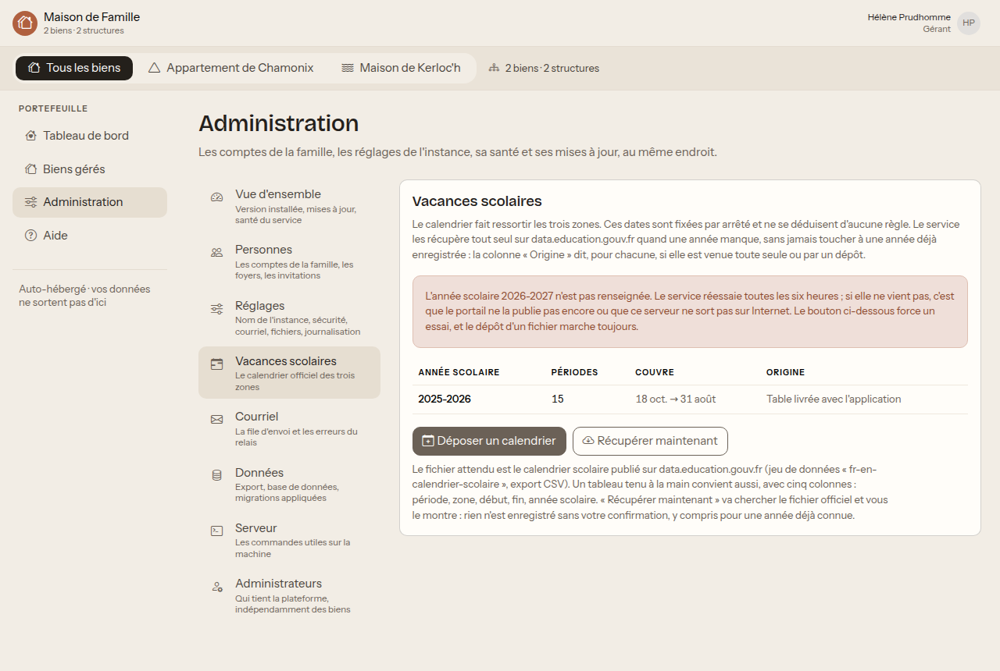

Les dates de vacances sont fixées par arrêté et ne se calculent pas. **Le
service va les chercher tout seul** sur data.education.gouv.fr quand l'année en
cours ou la suivante manque : le plus souvent, vous n'avez rien à faire, et la
colonne « Origine » du tableau dit ce qui est arrivé de cette façon.

Il ne touche jamais à une année déjà enregistrée. Vous reprenez donc la main
dans deux cas : un arrêté modifie des dates déjà en base, ou votre serveur n'a
pas le droit de sortir sur Internet.

1. Cliquez sur **Déposer un calendrier** et choisissez le fichier que vous avez
   téléchargé, ou sur **Récupérer maintenant** pour que le serveur aille le
   chercher.
2. Relisez l'aperçu.

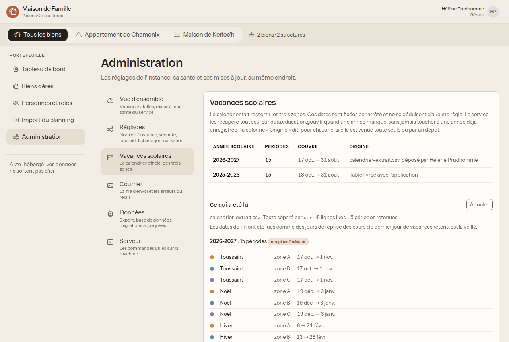

L'aperçu dit combien de lignes ont été lues, combien de périodes retenues,
quelles années seront ajoutées ou remplacées, et quelles lignes ont été écartées
avec leur raison (rentrées, lignes réservées aux enseignants, zones hors
métropole).

Il annonce aussi **comment les dates de fin ont été comprises** : le fichier
officiel donne le jour de la reprise des cours, un tableau tenu à la main donne
plutôt le dernier jour de vacances. Vérifiez que la phrase correspond à votre
fichier. Si ce n'est pas le cas, n'enregistrez pas.

3. **Enregistrer**. Rien n'est écrit avant ce clic.

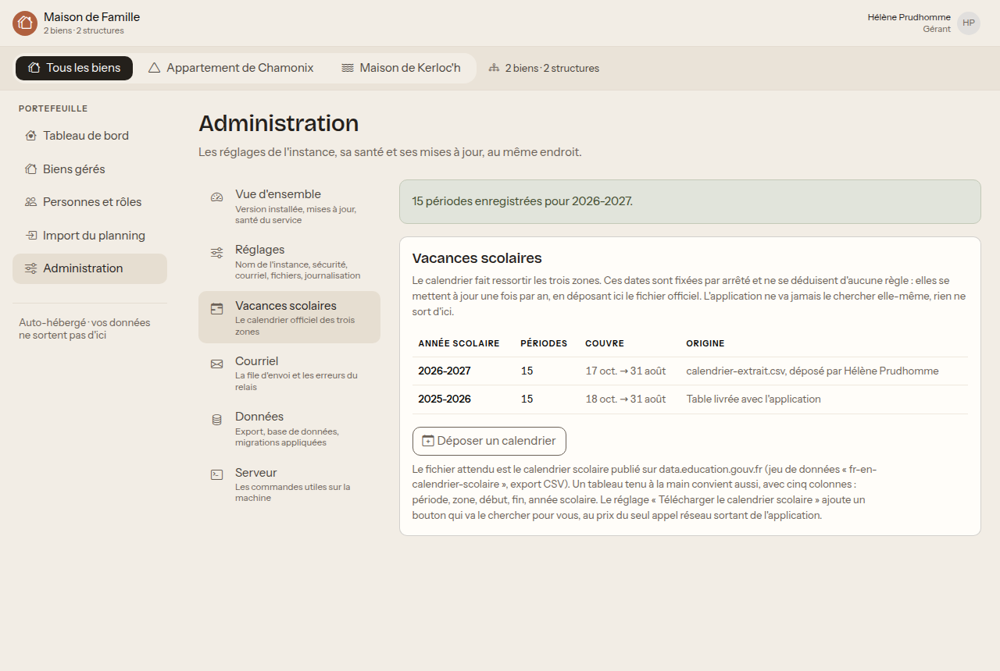

Un import remplace les années qu'il apporte et ne touche à aucune autre.

Les **jours fériés**, eux, n'ont jamais rien à mettre à jour : ils se calculent.
Un réglage ajoute les deux fériés d'Alsace-Moselle, à laisser éteint ailleurs.

## 15. Reprendre un planning existant

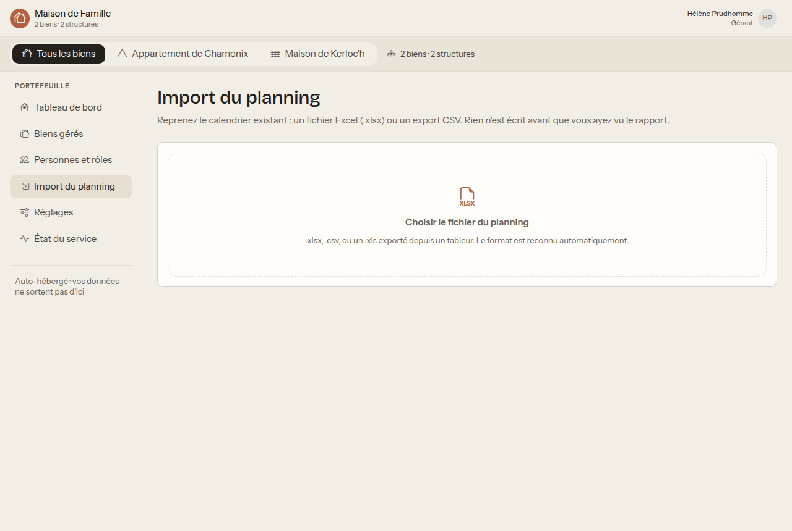

Si la famille tenait un tableur, vous n'avez pas à ressaisir dix ans de séjours.

L'import se fait en trois temps :

1. **Analyse** : vous déposez le fichier (.xlsx, .csv, ou un .xls exporté d'un
   tableur). L'application le lit et propose une correspondance des colonnes.
2. **Simulation** : vous corrigez la correspondance, et l'application dit ce
   qu'elle ferait. **Rien n'est écrit.**
3. **Exécution** : et seulement alors, l'écriture.

Un import se **défait entièrement** depuis la liste des imports, tant que vous
n'avez pas construit dessus. Si le résultat ne vous plaît pas, annulez et
recommencez avec une meilleure correspondance.

Les dates sont le piège habituel : un tableur français écrit `08/08/2026`, un
tableur anglais `8/8/2026`, et une cellule au format date sort parfois en numéro.
Les trois sont reconnues, et ce qui ne l'est pas est refusé ligne par ligne avec
sa raison, jamais deviné.

## 15 bis. Qui administre la plateforme

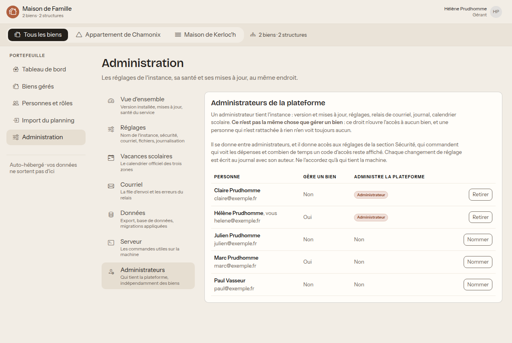

**Gérer un bien et tenir la machine sont deux choses différentes**, et depuis
cette version ce sont deux droits différents.

- **Gérant** : arbitrer les séjours, saisir les dépenses, tenir les papiers,
  les personnes et les rôles. C'est le métier décrit par tout ce guide.
- **Administrateur de la plateforme** : la version installée et les mises à
  jour, les réglages de l'instance, le relais de courriel, le journal, le
  calendrier scolaire. C'est l'entrée **Administration** du menu.

Les deux se cumulent souvent sur la même personne, mais rien ne l'oblige. Celui
qui héberge le service peut n'être qu'un membre de foyer, et une gérante qui n'a
jamais ouvert un terminal n'a pas à se voir proposer d'installer une mise à jour.

**Ce droit n'ouvre aucun bien.** Un administrateur qui n'est rattaché à rien ne
voit toujours aucun calendrier, aucune dépense, aucun code. L'export complet,
qui emporte toute la base, reste réservé aux gérants.

Il se donne dans **Administration**, section « Administrateurs », par un
administrateur en poste. Le dernier ne peut pas se retirer : sans personne pour
administrer, il faudrait un accès au serveur pour rouvrir l'écran.

Un point à connaître avant de l'accorder : les réglages de la section
**Sécurité** en font partie, et ils commandent qui voit les dépenses et combien
de temps un code d'accès reste affiché. Un administrateur peut donc s'ouvrir une
vue qu'il n'avait pas. Chaque changement est écrit au journal avec son auteur et
l'ancienne valeur, mais le droit ne s'accorde qu'à quelqu'un en qui la famille a
confiance pour la machine.

## 16. Sortir vos données

Dans **Administration**, section « Données ». L'export est réservé aux gérants :
il emporte toute la base, y compris ce qu'aucun rôle ne voit à l'écran. Un
administrateur de la plateforme qui n'est pas gérant tient la machine, pas le
contenu des dossiers.

- **Séjours en CSV** : le planning, pour un tableur.
- **Export complet de l'instance** : la base et toutes les pièces jointes, dans
  une archive qui se restaure sur une instance vierge.

Vous n'êtes prisonnier ni d'un tableur ni de cette application.

## 17. L'administration

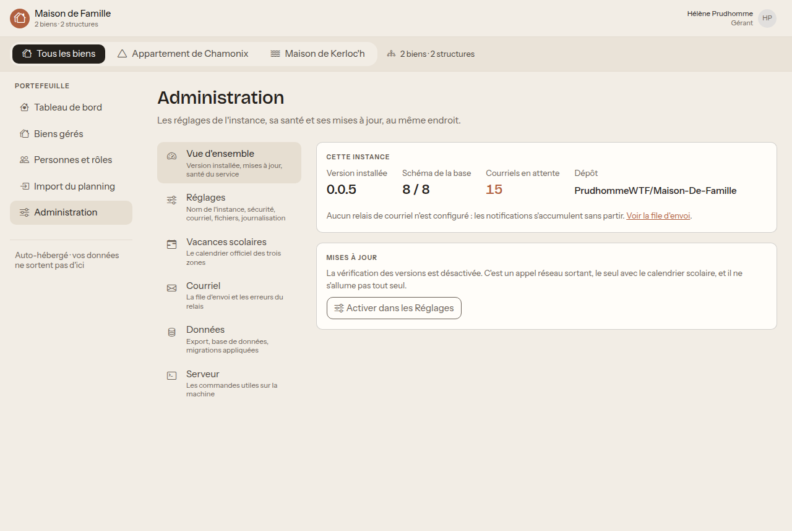

Tout ce qui concerne l'instance elle-même est là, rangé en six sections dont
chacune dit ce qu'elle contient :

| Section | Ce qu'on y trouve |
| --- | --- |
| **Vue d'ensemble** | La version installée, les mises à jour, la santé du service |
| **Réglages** | Nom de l'instance, sécurité, courriel, fichiers, journalisation |
| **Vacances scolaires** | Le calendrier officiel des trois zones |
| **Courriel** | La file d'envoi et les erreurs exactes du relais |
| **Données** | Export, base de données, migrations appliquées |
| **Serveur** | Les commandes utiles sur la machine |

**Courriel** est la section à ouvrir quand quelqu'un vous dit « je n'ai pas reçu
le courriel » : elle montre combien de messages attendent et, mot pour mot, ce
que le serveur de courriel a répondu.

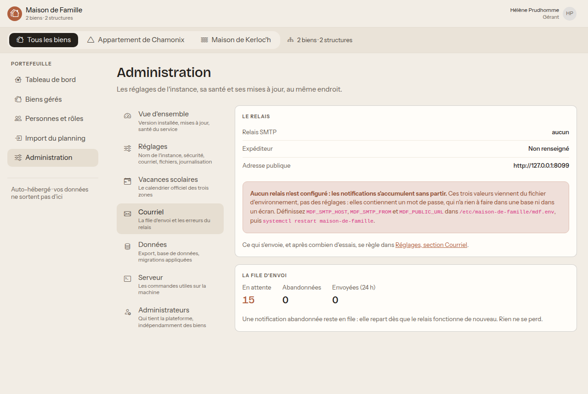

Le relais lui-même ne se règle pas depuis l'application : ses réglages
contiennent un mot de passe, qui n'a rien à faire dans une base ni dans un
écran. Ils vivent dans le fichier de configuration du serveur, et la section
vous dit lesquels et où.

### Mettre l'application à jour

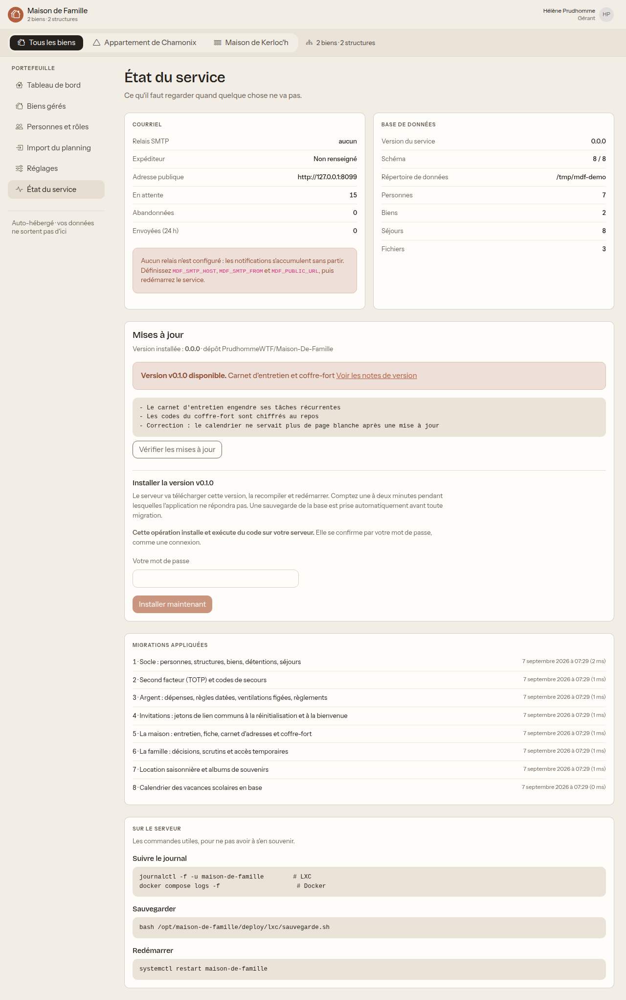

**Vue d'ensemble** dit la version installée, et ce que le service a vu la
dernière fois qu'il a demandé à GitHub. Il le demande de lui-même au démarrage
puis toutes les six heures : l'information est là quand vous ouvrez l'écran, sans
que vous ayez cliqué. « Vérifier maintenant » sert à ne pas attendre le prochain
passage.

**Regarder n'est pas installer.** Rien ne se met à jour tout seul, et
l'installation depuis l'écran demande un assistant posé sur le serveur. S'il n'y
est pas, l'écran le dit et donne la commande qui le pose.

Si la version installée s'affiche comme **inconnue**, le service n'a pas su la
déterminer. Toute comparaison est alors fausse, l'écran le dit et refuse de
prétendre le contraire ; relancer l'installateur suffit à corriger.

Quand une version est disponible, vous voyez ses notes, puis un formulaire qui
**redemande votre mot de passe**. Ce n'est pas de la formalité : ce bouton fait
exécuter du code sur votre serveur, et un téléphone déverrouillé oublié quelque
part ne doit pas suffire à le déclencher.

Comptez une à deux minutes pendant lesquelles l'application ne répond pas. Une
sauvegarde de la base est prise automatiquement avant toute migration, et le
service est relancé même si la mise à jour échoue.

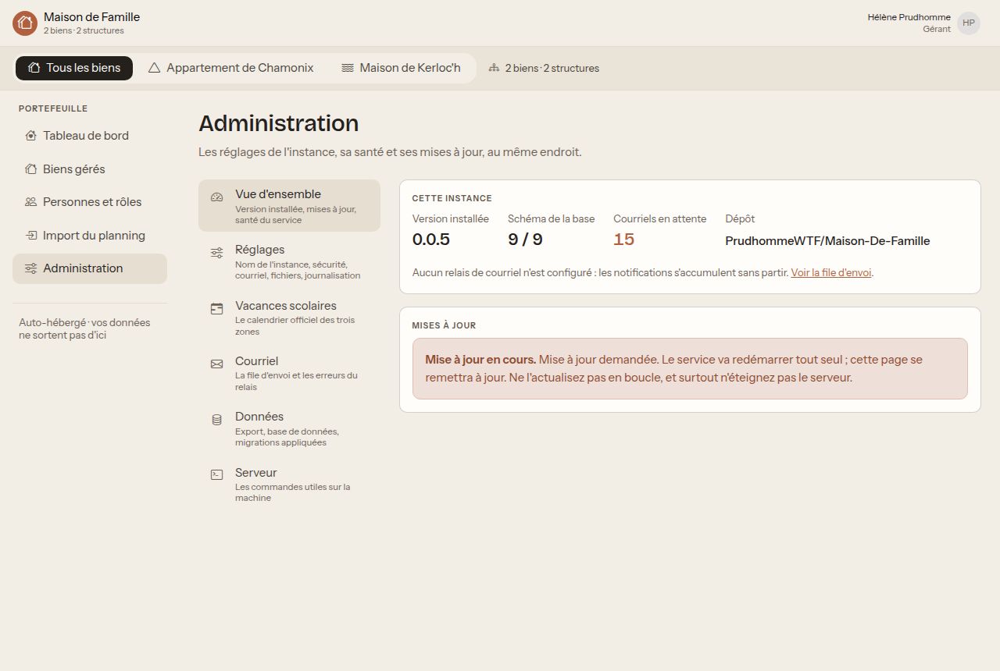

Si quelque chose s'interrompt, l'écran **rend la main tout seul** au bout d'un
quart d'heure sans progression, et vous donne le chemin du journal à lire. Vous
n'aurez jamais à aller supprimer un fichier sur le serveur pour retrouver un
bouton.

## Ce que vous ne pouvez pas faire

- **Voir un bien que vous ne gérez pas.** Le gérant d'une maison n'a aucun accès
  à une autre maison à laquelle il n'est pas rattaché, même en tapant l'adresse
  directement.
- **Connaître le mot de passe de quelqu'un.** Vous pouvez lui renvoyer un lien,
  jamais lire ou choisir son mot de passe.
- **Supprimer.** Rien ne se supprime : on archive, avec une date.
- **Défaire un vote.** Un scrutin s'annule, et l'annulation reste visible.

## Questions fréquentes

**Quelqu'un a changé les quotes-parts, est-ce que mes anciennes dépenses sont
fausses maintenant ?** Non. Chaque ventilation a été figée avec les parts en
vigueur à la date de la dépense. Changer les parts aujourd'hui ne touche rien du
passé.

**J'ai saisi une dépense avec la mauvaise date.** Annulez-la et resaisissez-la :
c'est la date qui détermine la répartition, elle ne se corrige pas à la légère.

**Un indivisaire dit qu'il ne voit pas les dépenses.** Vérifiez son rôle. S'il est
membre de foyer et non détenteur, c'est normal, et un réglage permet de lui
ouvrir l'accès si la famille le souhaite.

**Le lien d'invitation que j'ai envoyé ne marche plus.** Il a expiré ou déjà
servi. Cliquez sur « Renvoyer un lien » en face de la personne.

**Je veux enlever quelqu'un de l'indivision.** Saisissez une nouvelle répartition
sans lui, avec la date d'effet de l'acte. Son historique reste, ses dépenses
passées gardent leur part.

**Comment retirer l'accès à quelqu'un immédiatement ?** Pour un invité par lien :
« Révoquer ». Pour un compte : retirez son rôle, ou ses parts s'il en a.
