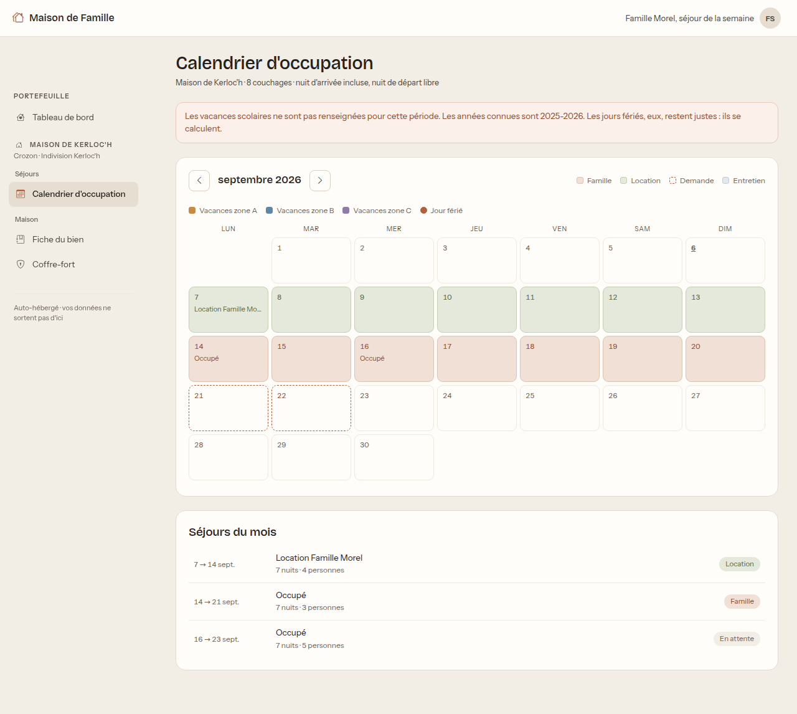
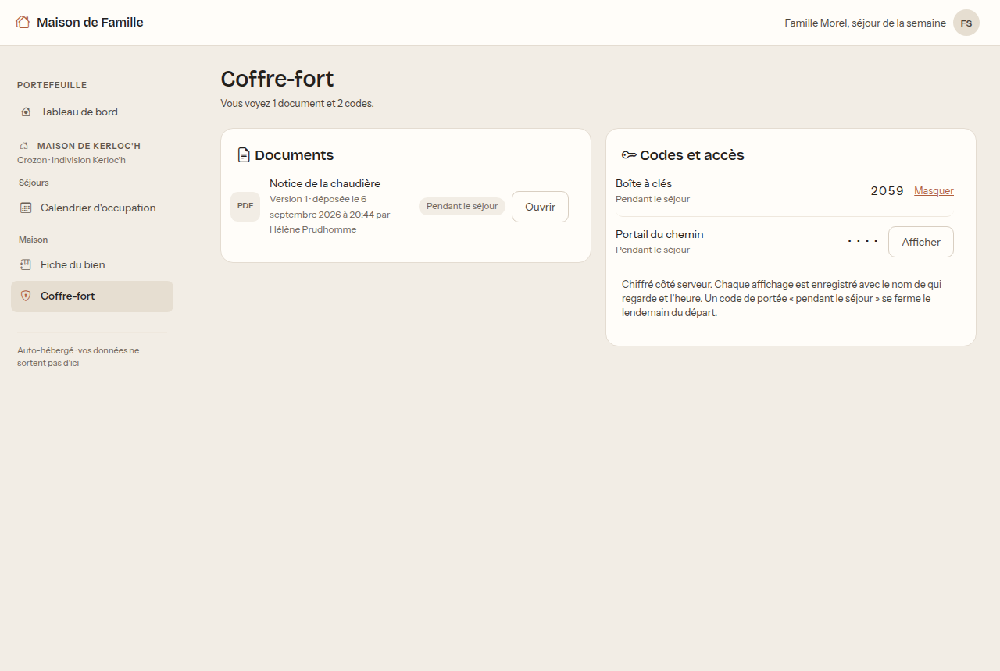
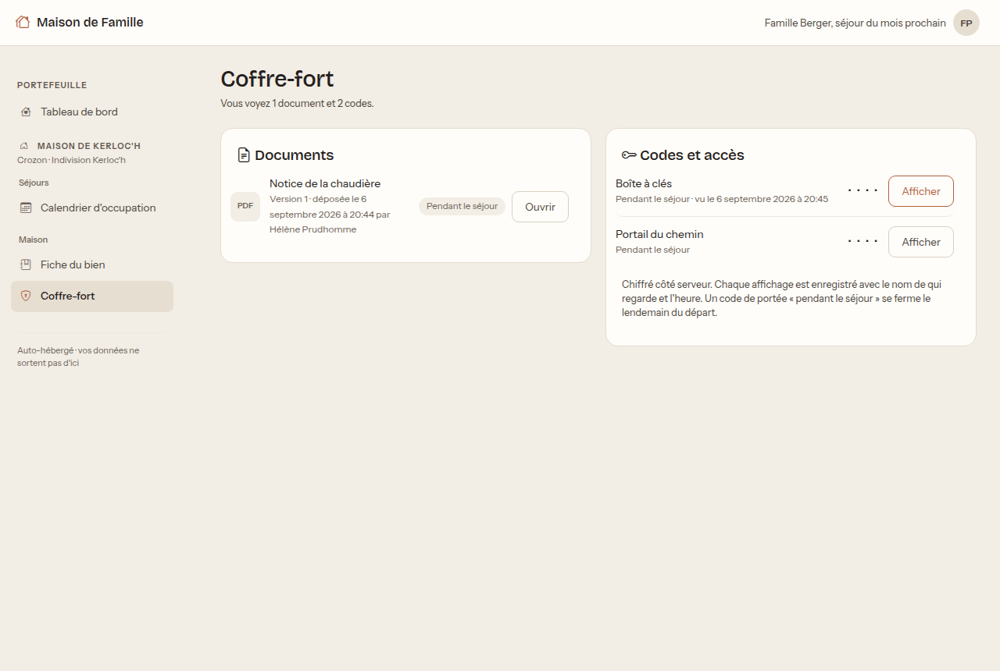
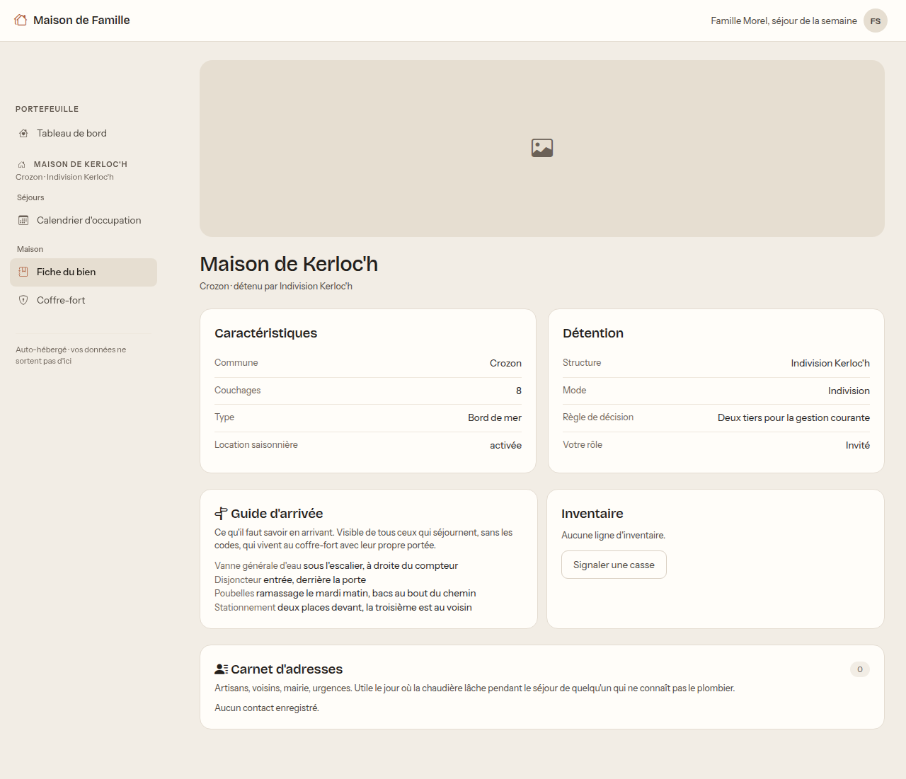
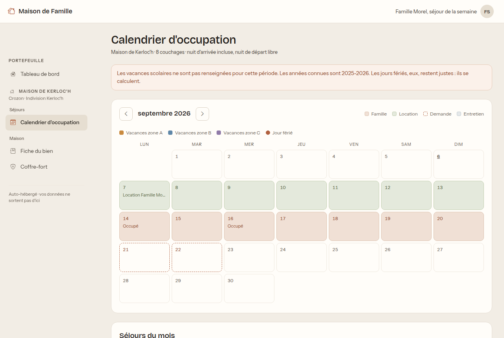

# Guide de l'invité

Vous avez reçu un lien pour un séjour dans une maison de famille : vous êtes
locataire, ami de la famille, ou artisan qui doit intervenir.

Ce guide fait deux pages, parce qu'il n'y a pas grand-chose à savoir. C'est
voulu.

## Vous n'avez pas de compte, et c'est normal

Pas d'inscription, pas de mot de passe à retenir. **Le lien est votre clé.**

Gardez-le : c'est lui qui vous fait entrer, à chaque fois. Si vous le perdez,
redemandez-le à votre interlocuteur dans la famille, qui vous en fournira un
nouveau.

Trois choses à savoir dès maintenant :

- **Le lien expire** à une date fixée par la famille, en général peu après votre
  départ.
- Il peut être **révoqué** à tout moment.
- Il ne donne accès qu'à **cette maison** et pour **cette période**.

Ne le publiez pas et ne le transmettez pas à quelqu'un qui n'est pas de votre
groupe : il ouvre les codes d'accès de la maison.

## Ce que vous voyez en entrant

Le menu de gauche est court, et il tient tout ce à quoi vous avez droit :

- **Calendrier d'occupation** : les périodes occupées de la maison.
- **Fiche du bien** : le guide pratique.
- **Coffre-fort** : vos codes et les documents utiles.

En haut à droite, le libellé de votre accès (par exemple « Famille Morel, séjour
de la semaine ») remplace le nom d'un compte.

## Trouver les codes d'accès

C'est probablement pour ça que vous êtes ici.

Ouvrez **Coffre-fort**.

Cliquez sur **Afficher** en face d'un code pour le révéler, puis **Masquer** pour
le recacher.

### Si vous ne voyez aucun code

Ce n'est pas une panne, et le lien n'est pas cassé.

> **Un code de séjour n'apparaît que quelques jours avant votre arrivée**, et il
> se ferme le lendemain de votre départ.

Si votre séjour est dans deux mois, l'écran vous dira « aucun code visible pour
vous », et les codes apparaîtront d'eux-mêmes le moment venu. Le nombre de jours
d'avance est réglé par la famille, souvent deux ou trois.

Si votre séjour commence demain et que vous ne voyez toujours rien, contactez
votre interlocuteur : c'est peut-être qu'aucun code n'a été rangé en portée
« pendant le séjour ».

### Ce qui est enregistré

Sans détour : **chaque affichage d'un code est enregistré**, avec le libellé de
votre accès et l'heure. Les gérants de la maison peuvent consulter ce journal.

Ce n'est pas de la surveillance. C'est ce qui permet de savoir qui a vu le code
de l'alarme le jour où il faut décider de le changer.

Les codes sont chiffrés sur le serveur et ne circulent qu'au moment où vous
cliquez sur « Afficher ».

## Le guide pratique de la maison

**Fiche du bien** répond aux questions d'une arrivée tardive : où est la vanne
générale d'eau, où est le disjoncteur, quel jour passent les poubelles, où se
garer, et qui appeler en cas de souci.

Prenez une minute pour la lire en arrivant, plutôt qu'à 23 heures avec une fuite.

## Le calendrier

Vous voyez les périodes occupées de la maison, dont la vôtre. Cela sert à situer
votre séjour, et à comprendre si quelqu'un part le matin de votre arrivée.

**Votre séjour est nommé, les autres sont marqués « Occupé ».** Vous savez donc
quand la maison est prise, pour quel usage et par combien de personnes, mais pas
par qui : les noms de la famille et ses échanges internes ne vous sont pas
montrés. C'est délibéré, dans les deux sens. Vous n'avez pas à connaître leurs
allées et venues, et ils n'ont pas à s'inquiéter de ce que vous lisez.

Rappel de la convention utilisée partout dans l'application : **la nuit d'arrivée
est comptée, la nuit de départ ne l'est pas.** Un séjour du 14 au 21 fait sept
nuits, et quelqu'un peut arriver le jour même où un autre s'en va.

## Ce que vous ne pouvez pas faire

- **Demander un séjour.** Vous en avez un, c'est la raison de votre accès. Il n'y
  a pas d'écran de demande dans votre menu.
- **Voir l'argent, l'entretien, les décisions de la famille.** Ces écrans
  n'existent pas pour vous, et les listes qui les résument non plus.
- **Savoir qui occupe la maison** en dehors de votre propre séjour.
- **Voir un autre bien.** Votre lien ne concerne que cette maison.
- **Modifier quoi que ce soit.**

## Questions fréquentes

**Mon lien ne marche plus.** Il a expiré, ou il a été révoqué. Demandez-en un
nouveau à votre interlocuteur dans la famille.

**Je n'arrive pas à me connecter avec une adresse et un mot de passe.** Vous n'en
avez pas, et vous n'avez pas à en avoir. Utilisez le lien.

**Je ne vois pas les codes.** Voir [Si vous ne voyez aucun
code](#si-vous-ne-voyez-aucun-code). Neuf fois sur dix, c'est simplement trop tôt.

**J'ai cassé quelque chose.** Prévenez votre interlocuteur : vous n'avez pas
d'écran pour le signaler vous-même. Dites-le, plutôt que de laisser le suivant
découvrir le problème.

**Le lien peut-il être partagé avec les autres personnes de mon groupe ?** Oui, au
sein du groupe qui fait le séjour. Pas au-delà : il ouvre les codes d'accès de la
maison.
