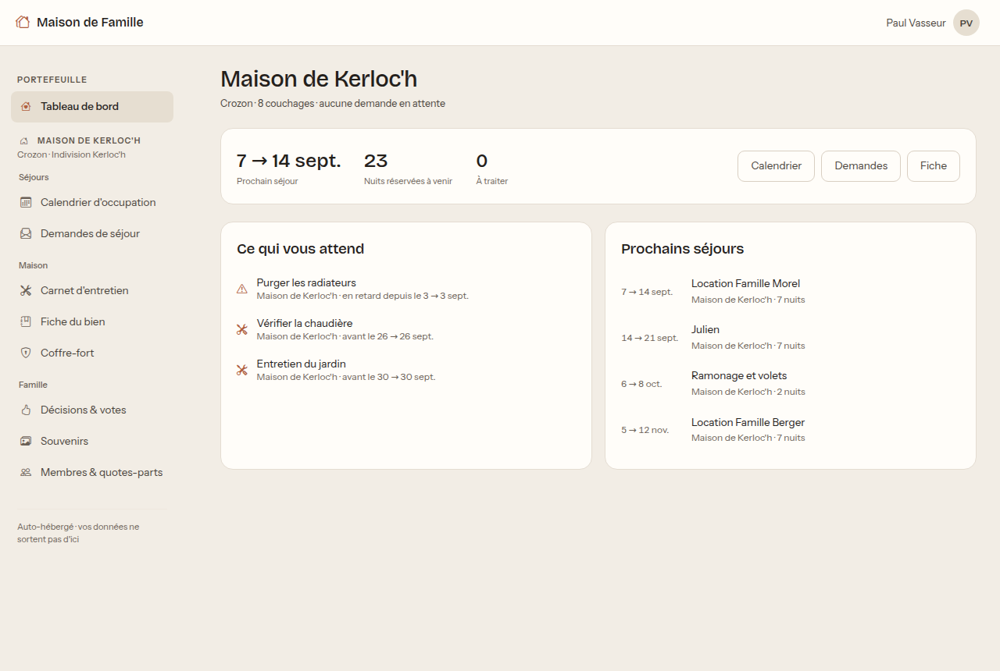
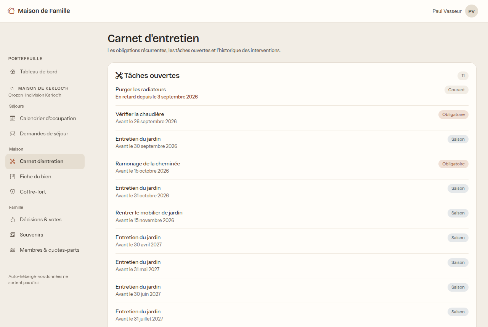
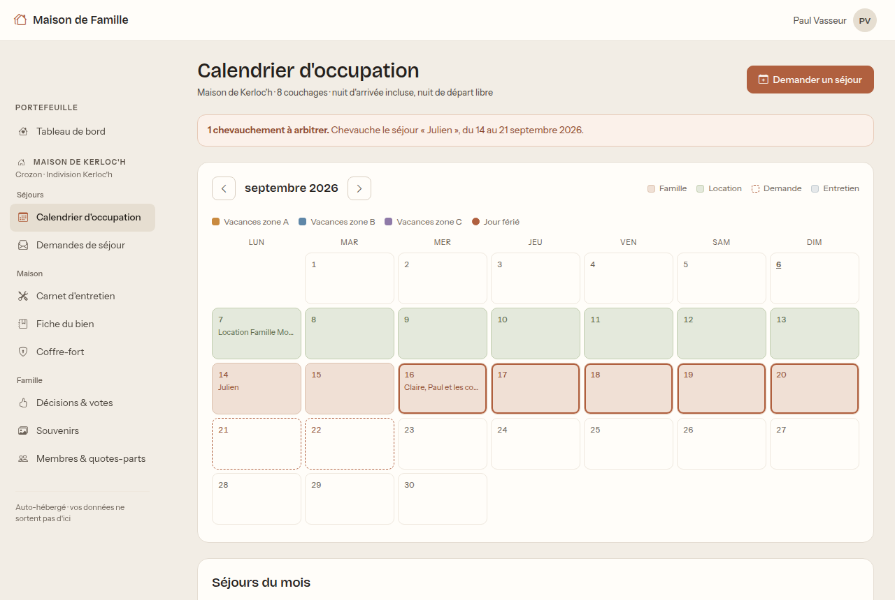
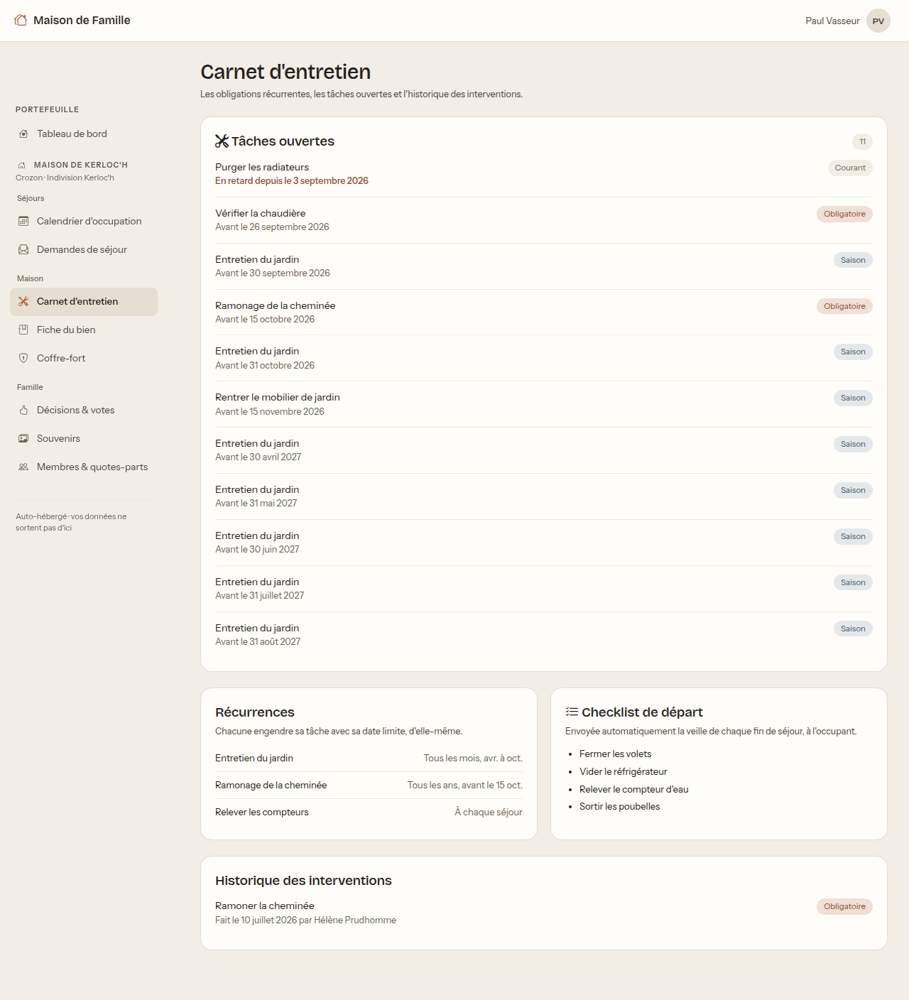
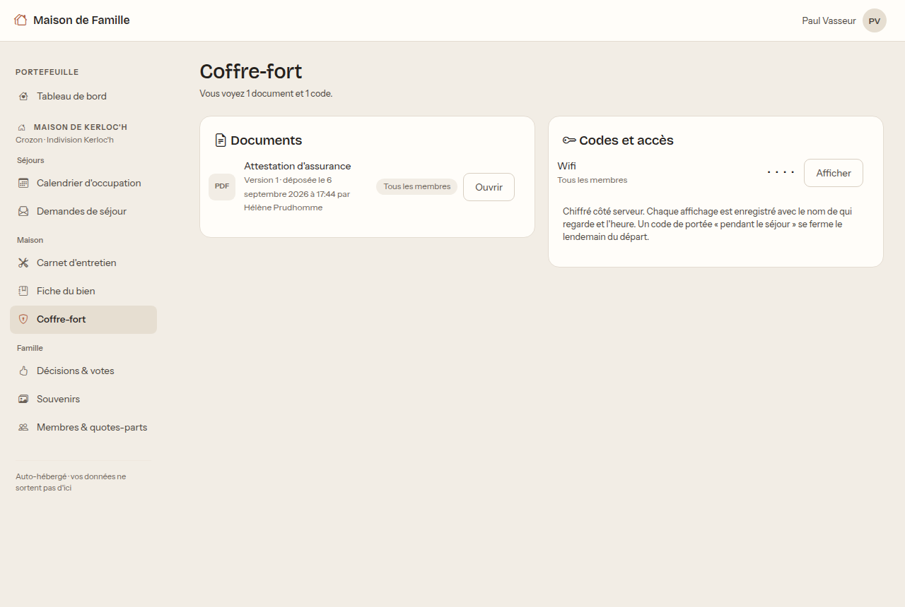

# Guide du membre de foyer

Votre conjoint possède une part de la maison de famille. Vous n'en possédez pas
vous-même, mais vous y venez, vous y dormez, et vous avez besoin d'y voir clair :
quand la maison est libre, où sont les clés, ce qui est cassé.

C'est exactement ce que vous donne l'application.

Lisez d'abord **[Premiers pas](premiers-pas.md)** si ce n'est pas fait.

## Pourquoi vous avez un accès

Vous n'avez rien eu à demander : dès qu'un gérant vous a rattaché au même
**foyer** que votre conjoint, ce que voit votre conjoint vous est ouvert, à une
exception près (l'argent, voir plus bas).

C'est fait exprès. Sans cela, il faudrait saisir chaque conjoint sur chaque
maison, et l'oubli se traduirait par « je ne vois pas le calendrier ».

## Votre écran d'accueil

Deux cartes :

- **Ce qui vous attend** : les tâches d'entretien en retard ou proches.
- **Prochains séjours** : qui vient, et quand.

Vous remarquerez qu'il n'y a **pas de carte Trésorerie** et pas de groupe
**Argent** dans le menu de gauche. Ce n'est pas une panne : voir
[Et l'argent ?](#et-largent).

## Demander un séjour

Vous demandez un séjour exactement comme un détenteur.

1. Ouvrez **Calendrier d'occupation**.
2. **Demander un séjour**, en haut à droite.
3. Arrivée, départ, nombre d'occupants, et un mot si vous voulez expliquer.
4. **Envoyer la demande.**

Un gérant arbitre et vous répond.

### Lire le calendrier

- Une **couleur** par nature de séjour, expliquée dans la légende : famille,
  location, demande en attente, entretien.
- Une demande pas encore validée est en **pointillés**.
- Les **bandeaux fins sous les cases** sont les vacances scolaires, un par zone.
- Un **jour férié** est marqué sur le numéro du jour, en gras avec un point.

Souvenez-vous de la convention des nuits : un séjour du 14 au 21 fait sept nuits,
et quelqu'un peut arriver le jour où un autre part.

## Le carnet d'entretien

Vous voyez tout : ce qui est en retard, ce qui vient, ce qui a été fait, et
l'inventaire du matériel avec son état.

**Vous pouvez signaler une casse.** C'est ouvert à tout le monde exprès : celui
qui casse un matelas est rarement celui qui gère la maison. Votre signalement
crée une tâche pour le gérant et une ligne d'inventaire, avec votre nom.

Signalez plutôt deux fois qu'aucune. Une casse tue une arrivée à 22 heures.

## Les papiers et les codes

Le coffre-fort vous ouvre :

- les **documents destinés aux membres** (attestation d'assurance, notices) ;
- les **codes de votre séjour**, quelques jours avant votre arrivée.

Les documents réservés aux détenteurs (convention d'indivision, actes) ne vous
sont pas montrés.

Cliquez sur **Afficher** pour révéler un code. À savoir, sans détour : **chaque
affichage est enregistré** avec votre nom et l'heure. Ce n'est pas de la
surveillance, c'est ce qui permet de savoir qui a vu le code de l'alarme le jour
où il faut le changer.

Un code marqué « pendant le séjour » se ferme après votre départ.

## Le reste

- **Fiche du bien** : les caractéristiques, le guide pratique (où est la vanne
  d'eau, quel jour passent les poubelles, où se garer) et les contacts utiles.
  C'est ce qu'il faut lire en arrivant la première fois.
- **Décisions et votes** : vous voyez les scrutins en cours et leur résultat.
  **Vous ne votez pas** : seuls les détenteurs de parts votent.
- **Souvenirs** : les albums photo des séjours. Vous pouvez y déposer les vôtres.
- **Membres et quotes-parts** : selon un réglage décidé par la famille, vous voyez
  qui compose l'indivision, avec ou sans la répartition chiffrée.

## Et l'argent

Vous ne voyez ni les dépenses ni les soldes. Ce n'est pas un oubli, et voici la
raison, dite franchement.

Le montant de la taxe foncière, ce qu'un tel doit à un autre, la répartition
patrimoniale : ce sont des informations qui appartiennent d'abord aux détenteurs.
Le défaut prudent est qu'un conjoint ne les découvre pas avant l'indivisaire
concerné.

**Ce défaut se change.** Deux réglages existent, « Les membres de foyer voient les
dépenses » et « Les membres de foyer voient les quotes-parts ». Si la famille
préfère la transparence complète, demandez à un gérant de les activer. C'est un
choix de famille, pas une limite technique.

## Ce que vous ne pouvez pas faire

- **Valider une demande de séjour**, y compris la vôtre.
- **Voter** une décision. Vous les lisez.
- **Saisir une dépense**, ni la voir par défaut.
- **Modifier** le carnet d'entretien, la fiche du bien ou le coffre-fort. Vous
  pouvez signaler une casse, c'est la seule écriture qui vous est ouverte de ce
  côté.
- **Voir une maison à laquelle votre foyer n'est pas rattaché.**

## Questions fréquentes

**Mon conjoint voit un écran que je n'ai pas.** C'est probablement le groupe
Argent. Voir [Et l'argent ?](#et-largent).

**Je ne vois plus rien du tout.** Votre lien de foyer a peut-être été retiré, ou
votre conjoint a cédé ses parts. Demandez à un gérant.

**Puis-je demander un séjour sans mon conjoint ?** Oui. Votre demande est la
vôtre, et le gérant l'arbitre comme une autre.

**Qui voit que j'ai regardé un code ?** Les gérants du bien, dans le journal du
code concerné. Personne d'autre.

**J'ai cassé quelque chose.** Signalez-le depuis le carnet d'entretien, en
décrivant ce qui s'est passé. C'est fait pour, et cela évite que le suivant
découvre le problème un vendredi soir.
