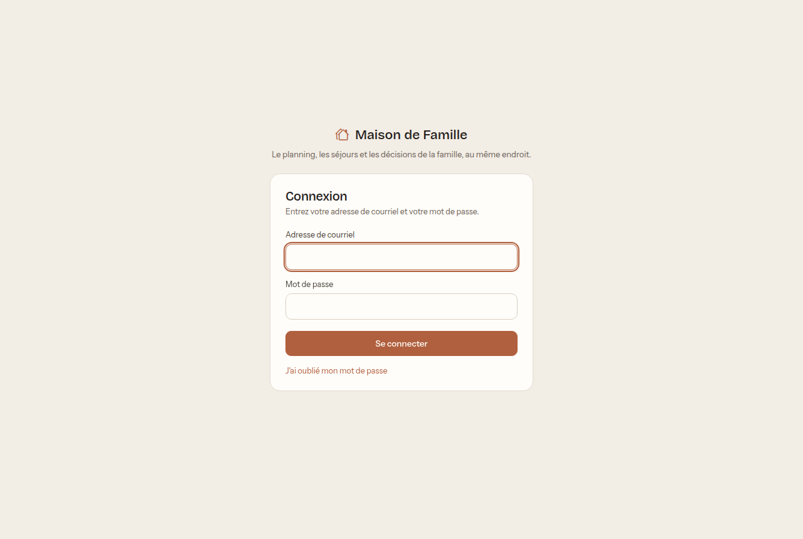
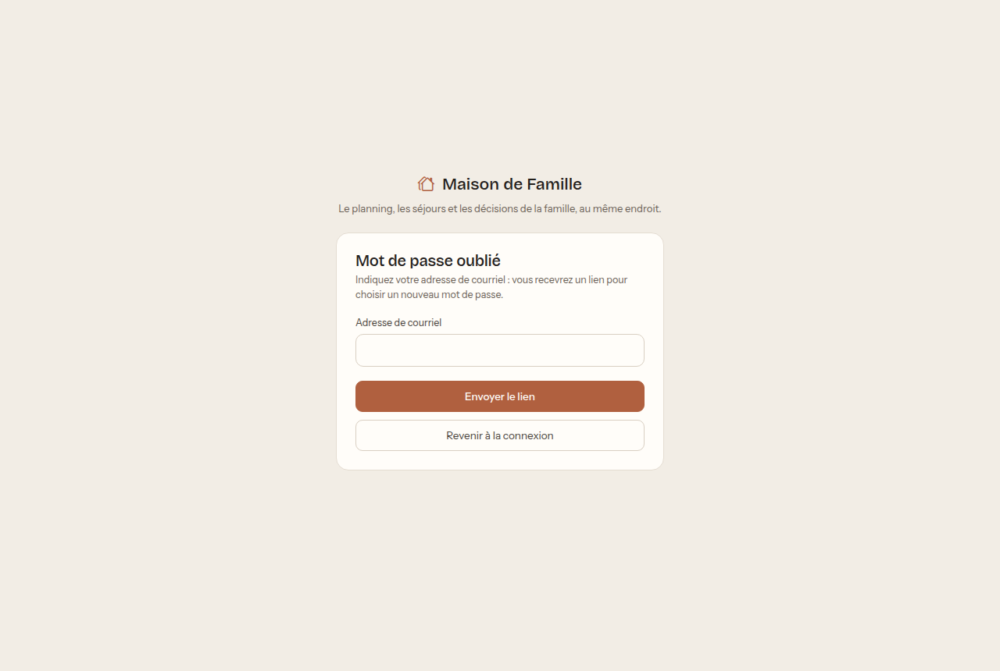
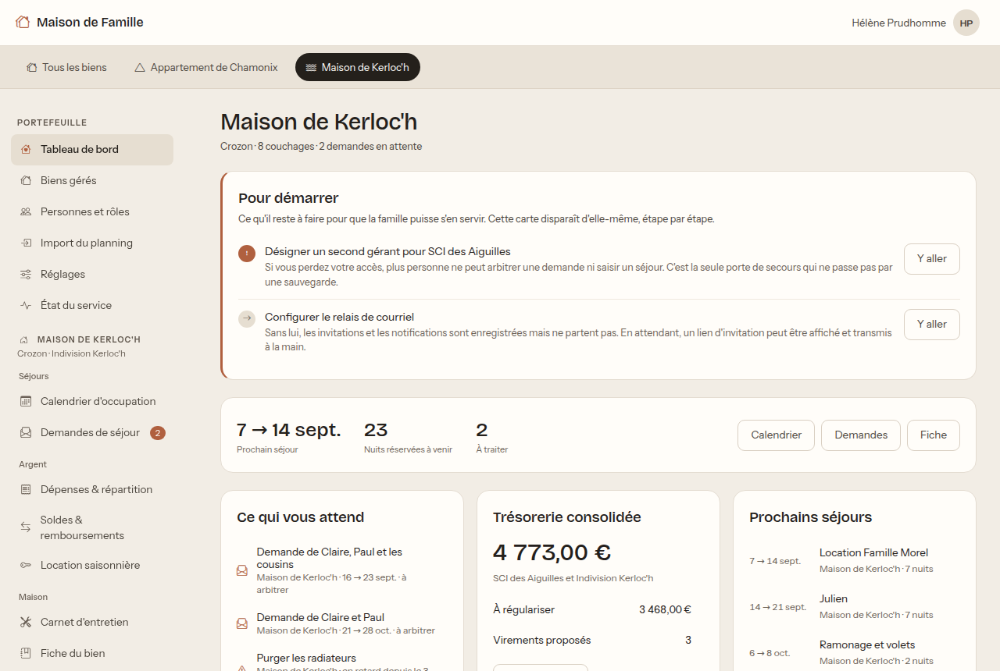
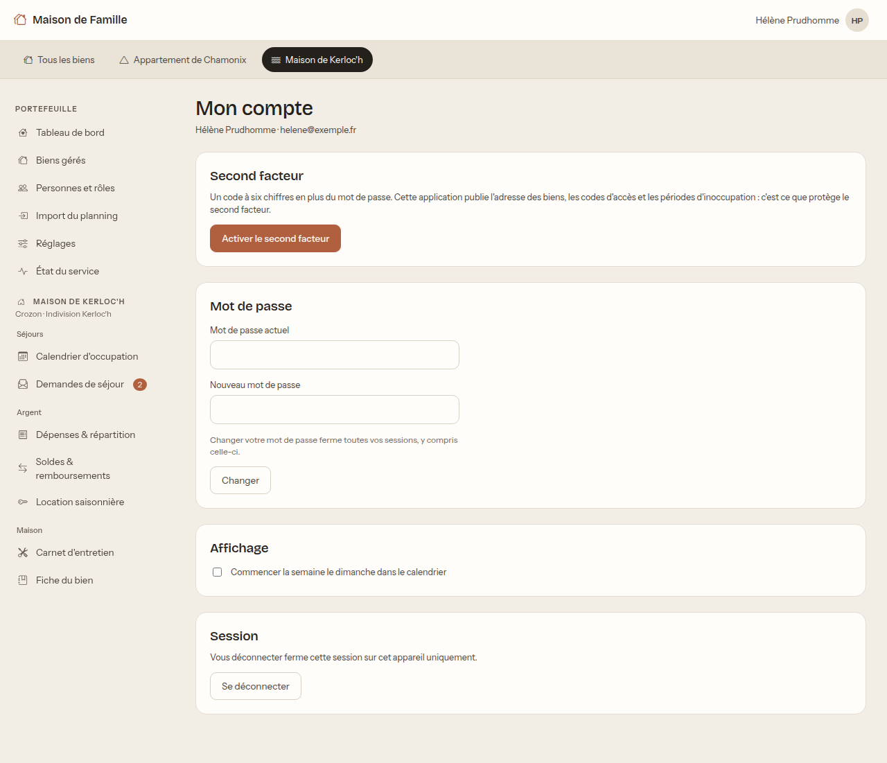

# Premiers pas

À lire une fois, quel que soit votre rôle. Comptez cinq minutes.

## 1. Vous recevez une invitation

La personne qui gère la maison vous crée un compte. Vous recevez alors un lien,
par courriel, ou de la main à la main si les courriels ne sont pas configurés.

Ce lien sert **une seule fois** et **expire**. Si vous le laissez dormir trop
longtemps, il ne marchera plus : ce n'est pas grave, demandez-en un nouveau, ou
utilisez « Mot de passe oublié » depuis l'écran de connexion.

En ouvrant le lien, vous choisissez votre mot de passe. Prenez-en un long, par
exemple trois ou quatre mots que vous seul associez. La longueur protège mieux
que les caractères bizarres, et se retient.

## 2. Vous vous connectez

Votre adresse de courriel, votre mot de passe. C'est tout.

**Mot de passe oublié.** Le lien sous le formulaire vous en renvoie un nouveau.

L'application répond toujours la même chose, que l'adresse existe ou non. C'est
voulu : sinon, n'importe qui pourrait savoir qui fait partie de la famille en
essayant des adresses.

## 3. Vous vous repérez

L'écran est toujours bâti pareil.

- **En haut à droite**, votre nom. Cliquez dessus pour aller dans **Mon compte**.
- **En haut**, une barre avec vos maisons, si vous en avez plusieurs. « Tous les
  biens » donne la vue d'ensemble, cliquer sur une maison entre dans son dossier.
  Si vous n'avez qu'une seule maison, cette barre n'apparaît pas : vous êtes
  déjà dedans.
- **À gauche**, le menu. Il est rangé par thème : Séjours, Argent, Maison,
  Famille. **Il ne montre que ce à quoi vous avez droit** ; si un thème entier
  vous manque, c'est normal, pas une panne.
- **Au milieu**, l'écran courant.

Sur téléphone, le menu de gauche devient une barre d'onglets en bas.

### Le tableau de bord

C'est la page d'accueil, et elle répond à une seule question : **qu'est-ce qui
m'attend ?**

- **Ce qui vous attend** : les demandes à arbitrer si vous gérez, les tâches
  d'entretien en retard, ce qui réclame une action.
- **Trésorerie** : ce qui reste à régulariser. Cette carte n'apparaît que si
  vous avez le droit de voir l'argent.
- **Prochains séjours** : qui vient, et quand.

## 4. Vous protégez votre compte

Ouvrez **Mon compte** en cliquant sur votre nom, en haut à droite.

**Le second facteur.** Un code à six chiffres, en plus du mot de passe, engendré
par une application sur votre téléphone (Google Authenticator, Aegis, FreeOTP,
ou celle de votre gestionnaire de mots de passe).

C'est fortement recommandé, et voici pourquoi sans détour : cette application
réunit l'adresse des maisons, les codes du portail et de la boîte à clés, et les
dates exactes où personne n'y sera. Un mot de passe seul, réutilisé ailleurs et
retrouvé dans une fuite, suffirait à donner tout cela.

Quand vous l'activez, l'application affiche des **codes de secours**. Imprimez-les
ou notez-les ailleurs que sur le téléphone en question. Ce sont eux qui vous
sauvent le jour où le téléphone tombe à l'eau.

**Le mot de passe.** Le changer ferme toutes vos sessions, y compris celle en
cours. C'est voulu : si quelqu'un s'était introduit, le changement le met dehors.

**L'affichage.** Une seule préférence pour l'instant : commencer la semaine le
dimanche au lieu du lundi, dans le calendrier.

## 5. Le vocabulaire de l'application

Quelques mots reviennent partout. Ils veulent dire ceci :

| Mot | Ce que ça veut dire |
| --- | --- |
| **Bien** | Une maison ou un appartement. |
| **Structure** | Ce qui possède le bien : une indivision, une SCI. |
| **Détenteur** | Celui qui possède une part. On dit « indivisaire » en indivision, « associé » en SCI, et l'application emploie le mot qui convient. |
| **Quote-part** | Votre part dans la structure. Elle sert à répartir les dépenses. |
| **Séjour** | Une période où quelqu'un occupe la maison. |
| **Demande** | Un séjour proposé, pas encore validé par un gérant. |
| **Foyer** | Vous et votre conjoint. Ce qui est accordé à l'un rejaillit sur l'autre. |
| **Ventilation** | Le détail de qui paie quoi sur une dépense. |

## 6. Les nuits, et pas les jours

C'est la seule convention qu'il faut avoir en tête, parce que tout en dépend :
les conflits, l'occupation, les quotas, le partage des frais.

> **Un séjour du 14 au 21 fait sept nuits.** La nuit d'arrivée est comptée, la
> nuit de départ ne l'est pas.

Conséquence pratique et voulue : **deux familles peuvent se croiser le 21.**
L'une part le matin, l'autre arrive le soir. L'application ne signale pas de
conflit dans ce cas, parce qu'il n'y en a pas.

## Questions fréquentes

**Je n'ai pas reçu le courriel d'invitation.** Regardez les indésirables. Si rien
n'arrive, l'envoi de courriels n'est peut-être pas configuré sur cette instance :
demandez à votre gérant de vous afficher le lien et de vous le transmettre
directement.

**Mon lien ne marche plus.** Il a expiré ou il a déjà servi. Utilisez « Mot de
passe oublié » sur l'écran de connexion.

**Je ne vois pas une maison dont on m'a parlé.** Vous n'y êtes pas rattaché. Ce
n'est pas un défaut d'affichage : l'application ne vous montre littéralement rien
d'un bien auquel vous n'avez pas de lien. Demandez à un gérant de vous rattacher.

**Une entrée de menu a disparu.** Vous avez sans doute changé de maison dans la
barre du haut, et le module n'est pas activé sur celle-ci (la location
saisonnière, par exemple, s'active bien par bien).

**Puis-je utiliser l'application depuis mon téléphone ?** Oui. Il n'y a rien à
installer, c'est un site. Ajoutez-le à votre écran d'accueil si vous l'utilisez
souvent.
